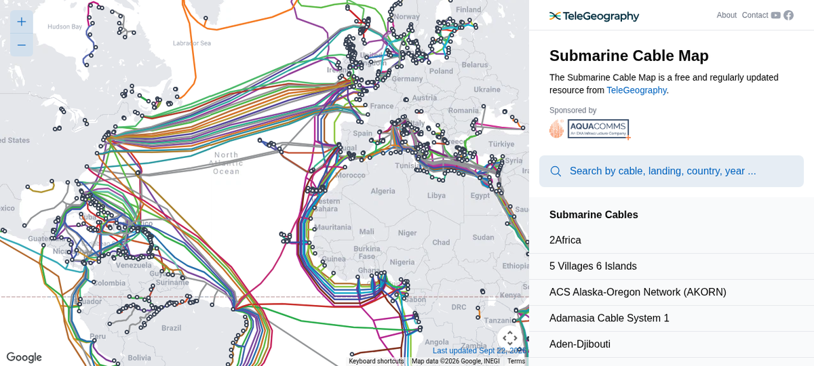
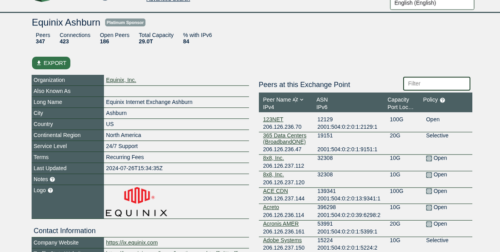
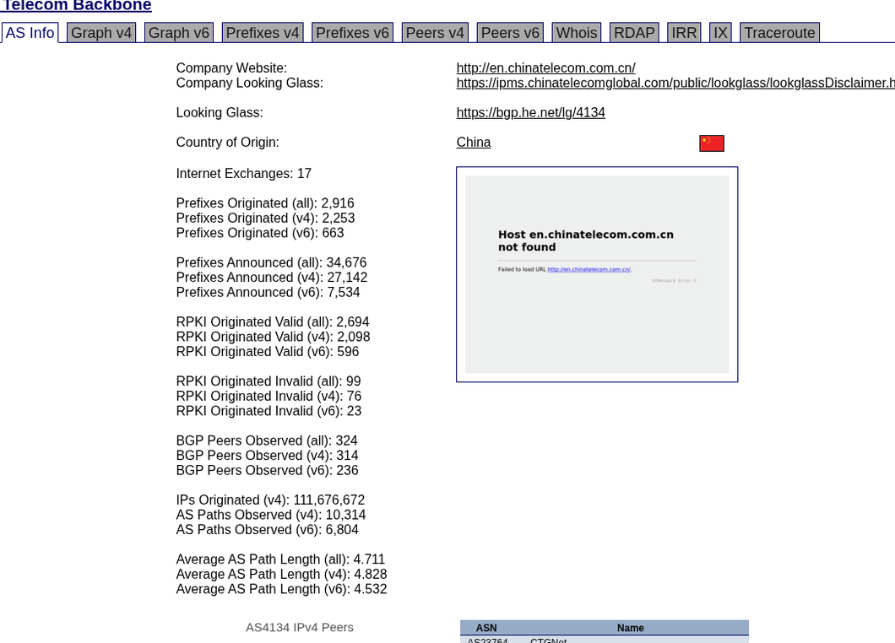
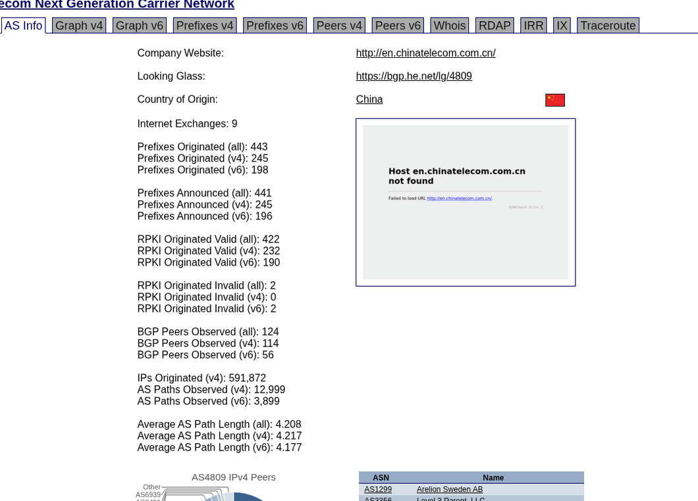
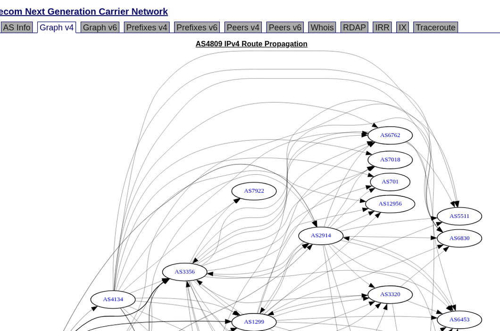
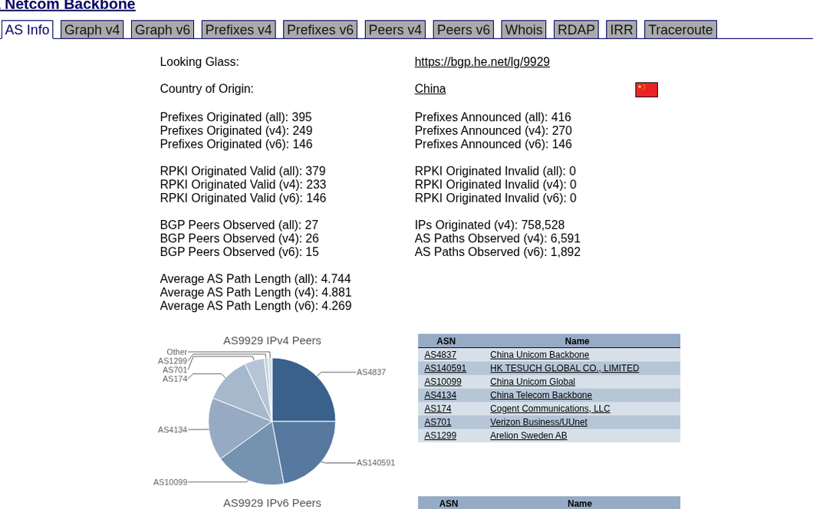
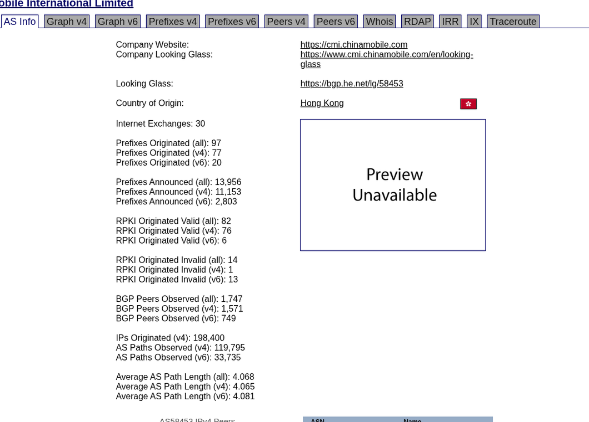
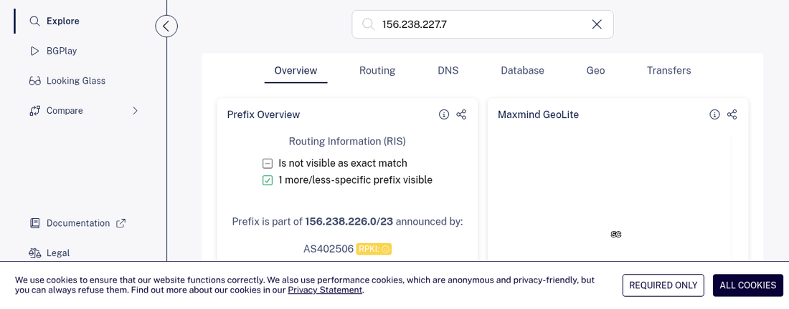

买 VPS 的时候，商品页上总会蹦出一堆黑话：`CN2 GIA`、`三网 9929`、`CMIN2`、`NTT 直连`、`软银`、`IIJ`……商家把线路当卖点吹，但绝大多数人根本不知道这些名字背后到底是什么网络，更不知道为什么同样的 1Gbps 带宽，价格能差十倍。

这篇文章从最底层的 **AS 号（自治系统号）** 讲起，把国际互联网和中国三大运营商骨干网的真实结构捋一遍，最后落到“怎么选 VPS 线路”的实操判断上。文中的数据全部来自公开 BGP 数据库（Hurricane Electric BGP Toolkit、RIPE stat、PeeringDB）和真实 traceroute 实测，不是抄来的营销话术。

---

## 一、互联网不是一张网，而是一堆网的“网之网”

我们常说“上网”，但其实互联网（Internet）本身是一张由几万个独立网络拼起来的联邦：

- 中国电信、中国联通、中国移动各自运营自己的全国骨干网；
- Cloudflare、Google、Amazon、Akamai 各自建了自己的全球网络；
- NTT、GTT、Cogent、Telia（Arelion）、Level3/Lumen 这些是跨国“转接运营商”（Transit Provider）；
- 这些网络之间通过**互联（Peering）**或**购买转接（Transit）**的关系互相连通。

每个独立运营的网络，在国际上有一个统一编号，就是 **AS 号（Autonomous System Number，自治系统号）**。

### AS 号是什么

AS 号是互联网上的“网络身份证号”。一个 AS 代表一个统一制定路由策略的网络，由 RIR（区域互联网注册机构：APNIC、RIPE、ARIN 等）分配。BGP（边界网关协议）就是让这些 AS 之间互相宣告“我拥有哪些 IP 段”“到达某个目的地需要经过哪些 AS”的协议。

常见的 AS 号都是公开可查的。比如中国电信 163 骨干网：

```
aut-num:   AS4134
as-name:   CHINANET-BACKBONE
descr:     No.31,Jin-rong Street  (中国电信总部，金融街31号)
country:   CN
```

以及电信 CN2：

```
aut-num:   AS4809
as-name:   CHINATELECOM-CORE-WAN-CN2
descr:     China Telecom Next Generation Carrier Network
country:   CN
```

上面两条是直接从 RIPE Database / radb 的 whois 数据里取的，任何人都可以复核：

```bash
whois AS4134
whois -h whois.radb.net -- '-i origin AS4809'
```

### 用工具查 AS 和路由信息

日常选 VPS、排查网络问题时，这几个公开工具最实用：

| 工具 | 用途 |
|---|---|
| [bgp.he.net](https://bgp.he.net)（Hurricane Electric BGP Toolkit） | 查 AS 的规模、邻居、前缀、RPKI 状态 |
| [stat.ripe.net](https://stat.ripe.net)（RIPEstat） | 查 IP/前缀归属、RPKI 有效性、地理与路由历史 |
| [peeringdb.com](https://peeringdb.com) | 查 IX（交换中心）和各网络在某机房的互联情况 |
| `traceroute` / BestTrace / nexttrace | 实测路由路径，识别走了哪家运营商 |
| [submarinecablemap.com](https://www.submarinecablemap.com) | 全球海底光缆地图，理解国际出口的物理走向 |

下面这张全球海底光缆地图，就是国际流量的物理底座——所谓“国际线路”，最终都要落到这些海缆和交换中心上：



---

## 二、Tier 1、Transit 与 Peering：钱和流量是怎么流动的

理解线路价格差异，要先理解三种连通方式：

1. **Transit（转接）**：我付钱给上游，通过它到达全球互联网。家用宽带、绝大多数云厂商的国际方向都在买 transit。
2. **Peering（对等互联）**：两个网络在交换中心（IX）或私下光纤上直接握手，互不付钱（或者结算很小），流量直达。
3. **Tier 1**：不需要向任何人买 transit、仅靠 peering 就能到达全球所有网络的运营商，历史上如 Lumen（AS3356）、Cogent（AS174）、Arelion/Telia（AS1299）、NTT（AS2914）、GTT（AS3257）等。



以电信 AS4134 为例，在 bgp.he.net 上能看到它的直接邻居就有 CTGNet（AS23764，电信国际）、联通骨干（AS4837）、Cogent（AS174）、Arelion（AS1299）、Lumen（AS3356）、GTT（AS3257）、NTT（AS2914）、TATA（AS6453）等——它一边买着这些 Tier 1 的 transit，一边也和国内友商对等：



**关键推论**：你买的 VPS“走 NTT/HE/GTT”，本质上就是这家 IDC 向这些上游买了 transit；而“走 CN2 GIA”则是中国电信自己卖给你的一段高价精品转接。上游选择决定了晚高峰时段你遭遇什么样的拥塞与路由。

---

## 三、中国三大运营商骨干网全图

国内通往国际互联网，绕不开三张（其实更多）骨干网。下表是这一节的核心速查表：

| 运营商 | 民用骨干网 | 高端/精品网 | 国际公司 | 路由识别特征 |
|---|---|---|---|---|
| 中国电信 | AS4134（163 / ChinaNet） | AS4809（CN2） | CTGNet AS23764 | 163 节点多为 `202.97.x.x`；CN2 为 `59.43.x.x` |
| 中国联通 | AS4837（169 / CU169） | AS9929（CUII，原网通 A 网） | China Unicom Global AS10099 | 9929 节点多为 `218.105.x.x`、`218.106.x.x` |
| 中国移动 | AS9808（CMNET） | AS58807（CMIN2 精品网） | CMI AS58453 | 移动国际节点多为 `223.120.x.x` |

### 3.1 电信：AS4134（163）vs AS4809（CN2）

**163 骨干（ChinaNet）**是电信最早、用户最多、承载 90% 以上流量（包括家宽用户）的网络。便宜，但国际出口在晚高峰严重拥堵，去北美丢包 10%–30% 都不稀奇。

**CN2** 是电信 2005 年前后为政企客户建的“第二张网”——不是 163 的升级版，而是物理独立、设备独立、海缆容量独立的另一张网络，扁平化、轻载运行，国内 7+ 个核心节点（北上广宁武西成）+ 香港、新加坡、东京、伦敦、法兰克福等海外 POP。CN2 的产品分两档：

- **CN2 GT（Global Transit，全球中转）**：半程精品。国内段仍走 163，出了国际关口才上 CN2。便宜些，但国内段照样堵。
- **CN2 GIA（Global Internet Access，全球互联网接入）**：全程精品。双向都走 AS4809，回国最高优先级、独立出口，是民用可达范围内最稳的中国方向线路之一。缺点：贵（国际带宽成本可达 $100+/Mbps 量级）、容量小，大流量 DDoS 下更容易整体波动。

CN2 在 BGP 层面体量比 163 小得多（AS4809 只有 245 个 v4 前缀、约 59 万 IP，而 AS4134 是上亿级），但它与 Lumen、Arelion、NTT、GTT、PCCW 等 Tier 1 都有直接对等：





**怎么用 traceroute 区分**：看到 `59.43.x.x` 就是进了 CN2；全程只有 `202.97.x.x` 就是纯 163。

### 3.2 联通：AS4837（169）vs AS9929（CUII）

联通的民用骨干是 AS4837（俗称 169 网，前身是原中国网通的骨干）。而 **AS9929** 是原网通 A 网——当年花重金买的 Nortel 设备、定位为政企精品网的资产，合并后成了联通手里最值钱的一张网。9929 的特点是：

- 设备冗余度高、轻载运行，晚高峰依然稳；
- 海外 POP（洛杉矶、圣何塞、东京、新加坡、法兰克福等）质量很好；
- 但 BGP 体量小、对外互联克制（看它只有 27 个 BGP 邻居，peer 主要是自家 10099 国际公司、电信 AS4134 和少数 Tier 1），所以“真 9929”资源稀缺，很多商家拿 169 冒充。



**识别特征**：路由中出现 `218.105.x.x` / `218.106.x.x` 才算进了 9929；只看到 `219.158.x.x` 是 169。

### 3.3 移动：AS9808（CMNET）、AS58453（CMI）与 AS58807（CMIN2）

移动起步最晚，早年国际出口是全网最烂，“移动打不开国外网站”的口碑就来自这里。翻身靠两张牌：

- **CMI（AS58453，中国移动国际）**：总部香港，BGP 邻居 1747 个、接入 30 个 IX，与几乎所有 Tier 1 和 APAC 运营商对等——这是移动国际方向现在体验好的根本原因；
- **CMIN2（AS58807）**：移动后来建的精品网，对标 CN2 GIA，回国优先级高、晚高峰稳，商家宣传里的“三网 CMIN2”就是指它。



**识别特征**：`223.120.x.x` 是 CMI；CMIN2 节点是 `223.119.x.x` 段等（各工具库标注略有差异，以 BestTrace 库为准）。

### 3.4 实测：一次真实 traceroute 长什么样

下面是一段从国内电信家宽出发的真实 traceroute（本会话实测数据，IP 归属均可反查）：

```
$ traceroute -n -q 1 223.5.5.5
 5  125.123.254.160  4.208 ms   # 城域网（浙江电信）
 6  125.123.254.49   8.361 ms   # 城域网
 7  115.233.23.170  12.397 ms   # 省网/骨干入口
 8  115.238.21.121  12.282 ms   # AS4134 骨干
 —  此后节点不回 ICMP（骨干路由器常见策略），目标已可达
```

规律：省内城网 → 省网 → 骨干（202.97 或 163 其他段）→ 国际出口。骨干路由器普遍对 ICMP 限速或不响应，中间出现 `* * *` 是正常现象，不代表网络坏了；真正要看的是**最后一跳延迟**和**是否绕路**（比如去美国方向从韩国/日本绕）。

另外一个有趣的事实：如果目标 IDC 和我所在的机房有直接 Peering，TCP traceroute 会显示 `1 hop, 1.2ms` 直达——这就是 Tier 1/大型云网络之间 private peering 的威力。

---

## 四、海外线路名词表：NTT、GTT、Cogent、IIJ、软银都是什么

商家页面上出现的“海外线路”，按性质分三类：

### 4.1 国际 Tier 1 / Transit 运营商

| 名字 | AS 号 | 说明 |
|---|---|---|
| Lumen / Level3 | AS3356 | 老牌 Tier 1，欧美骨干巨大 |
| Cogent | AS174 | 便宜大碗，欧美拥堵时口碑一般，但到部分云极快 |
| Arelion（原 Telia Carrier） | AS1299 | 欧洲最强骨干之一，很多海缆的买家 |
| GTT | AS3257 | 收购了多家运营商（UUNET/Teleglobe/T&E），全球覆盖广 |
| NTT（America/Global） | AS2914 / AS4780 | 美日方向强，香港 CN2 出海常借道它 |
| Hurricane Electric | AS6934/6939 | “疯狂铺海缆”的 HE，机房互联便宜，洛杉矶 APX/PRX 是网红接入点 |
| Tata Communications | AS6453 | 拥有大量自有海缆 |

### 4.2 日本/东南亚本地运营商

- **IIJ（AS24059 / AS4651）**：日本老牌 ISP，高端企业网，回国路由相对干净；早年“大阪 IIJ”线路几乎就是日本 VPS 质量天花板代名词，如今热度下降但仍是好选择。
- **软银 SoftBank（AS17676）**：日本三大 ISP 之一，对移动/联通友好，便宜，晚高峰一般。
- **KDDI（AS2516）**、**NTT 日本（AS2914/AS4780）**：日本本地质量标杆，回国常配合 CN2/CMI 回程。
- **PCCW Global（AS3491，现属 NTT）**、**Singtel（AS7473）**：港澳新方向的传统玩家。

### 4.3 中国运营商的“国际公司”

- **CTGNet（AS23764）**：电信国际，CN2 的海外销售面孔；
- **CUniq / China Unicom Global（AS10099）**：联通国际，背后接的就是 9929；
- **CMI（AS58453）**：移动国际，CMIN2/CMI 的海外入口。

很多“回国优化线路”本质是：**海外 IDC 花钱买这些国际公司的 transit，从而让你的回程流量从正常 Tier 1 换上了中国运营商的精品专网**。

---

## 五、去程 vs 回程：为什么你测出来的线路和商家宣传不一样

BGP 路由是**方向性**的：

- **去程（我 → VPS）**：由我家宽带运营商的出口策略决定，普通用户基本改不了；
- **回程（VPS → 我）**：由 VPS 所在机房“买谁家的 transit/peering”决定，这就是商家能操作的部分。

所以评测里常说的“三网回程 CN2 / 回程 9929 / 双程 GIA”，意思全在回程路由上。判断方法：

1. 在 VPS 上装 BestTrace/IPIP 路由脚本（或 `nexttrace`），从国内节点反向 traceroute 到 VPS；
2. 看 AS 号：回程出现 `AS4809` 是电信 CN2，`AS9929` 是联通精品，`AS58807`/`AS58453` 是移动 CMIN2/CMI；
3. 去程可以用 bgp.he.net 的 Super Traceroute 从全球节点看多路视角。

**避坑要点**：
- “CN2”≠“CN2 GIA”：GT 只是国际段借道 CN2，国内段照样 163。
- “三网优化”很多只是回程移动走 CMI、电信走 CN2 GT 的混搭，别看到宣传词就当成全程精品。
- 机房宣传的 `9929`，若路由里没有 `218.105/218.106` 段，大概率是 169 冒充。
- 带宽大小不重要，**晚高峰丢包率和单线程 TCP 吞吐**才重要——很多“1Gbps”精品线路实测晚高峰 100Mbps 都吃力，而优质线路 300Mbps 稳如狗。

---

## 六、落到选购：常见需求怎么匹配线路

| 使用场景 | 推荐方向 | 典型线路选择 |
|---|---|---|
| 自建网站/服务主要给国内用户访问 | 回程必须稳，首选回国精品网 | 洛杉矶 CN2 GIA / 三网 9929 / CMIN2；预算高可选香港直连 |
| 主要用途是访问海外 AI/流媒体/API | 去程质量为主 | 日本 IIJ/软银、新加坡、美国 HE/Oracle 免费档均可；关键是 IP 干净（见下） |
| 需要“原生 IP”解锁流媒体/支付验证 | 看 IP 所在 ASN 与广播地是否一致 | 选本地 ISP 住宅/企业段 IP，避开明显机房段 |
| 大流量下载/PT | 带宽便宜抗打 | 纯国际 transit（Cogent/HE/GTT 类）大容量机房，不追求回国精品 |
| 低延迟游戏联机/交易 | 物理距离优先 | 日本/韩国/新加坡机房 > 美国，精品网 > 普通 transit |

顺带说一句 IP 查询：任何一个 VPS 的 IP，都可以丢进 RIPEstat 看它的广播前缀、所属 ASN 和 RPKI 状态——机房把 IP 挂在哪儿、卖的是什么身份，一目了然：



---

## 七、动手清单：三个 5 分钟就能做完的检查

1. **查你家宽带的国际出口**：
   ```bash
   traceroute -n 1.1.1.1     # macOS/Linux
   tracert -d 1.1.1.1        # Windows
   ```
   数一数第几跳出省、第几跳出国，晚高峰重复测 3 次记录延迟。
2. **查 VPS 的 BGP 身份**：访问 `https://bgp.he.net/<你的IP>`，看它属于哪个 ASN、上游是谁。
3. **查线路是否名副其实**：在 VPS 上跑 IPIP BestTrace / `nexttrace`，从国内三网各测一次回程路由，对照本文表格里的 AS 号段自行验货。

---

## 结语

线路玄学的本质是信息差：**AS 号、BGP 邻居、路由段**都是公开的、可验证的硬数据，而绝大多数人只看到了商家贴出来的那行红字。把“走什么网、谁付钱给谁、哪个方向走哪条路”这三件事想清楚，CN2/9929/CMI/NTT/GTT 这些词就不再是营销术语，而是你在购买页上明码比价的筹码。

> 数据与图片说明：本文 BGP 数据截图来自 Hurricane Electric BGP Toolkit（bgp.he.net）、RIPEstat、PeeringDB、TeleGeography Submarine Cable Map 实时页面；traceroute 与 ASN 查询为本机实测，全部可复核。
