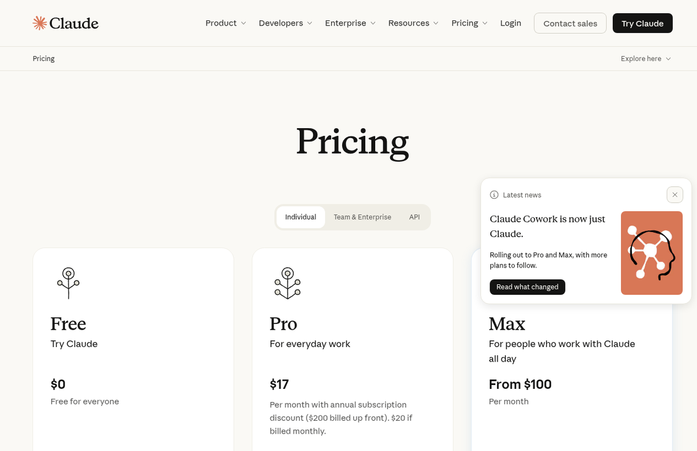
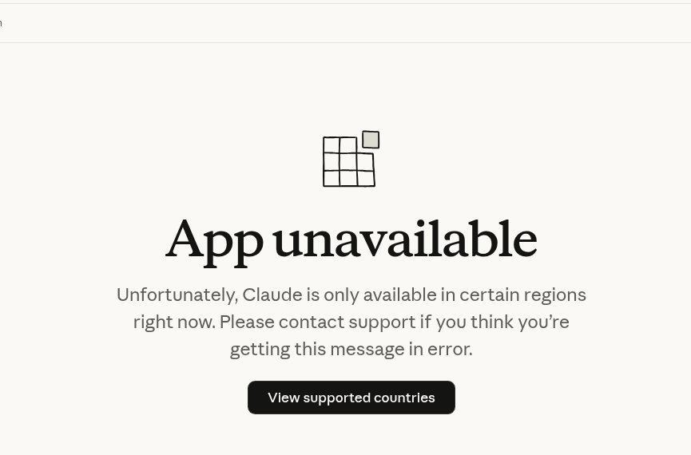
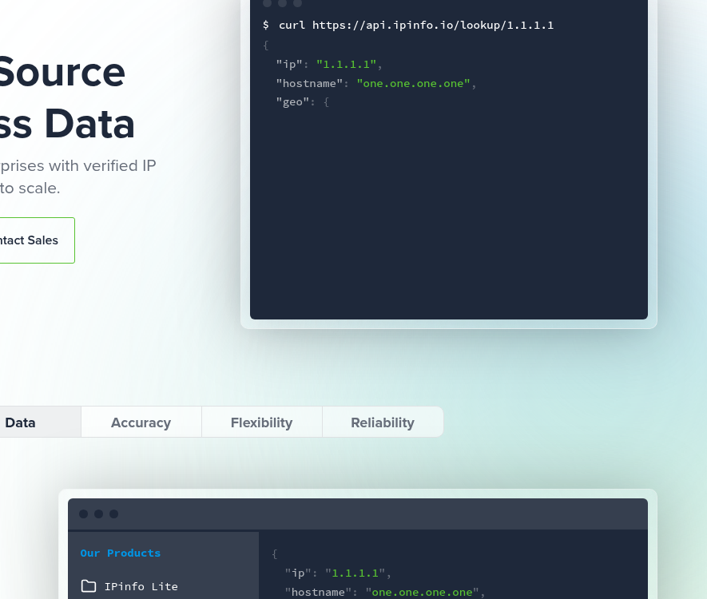
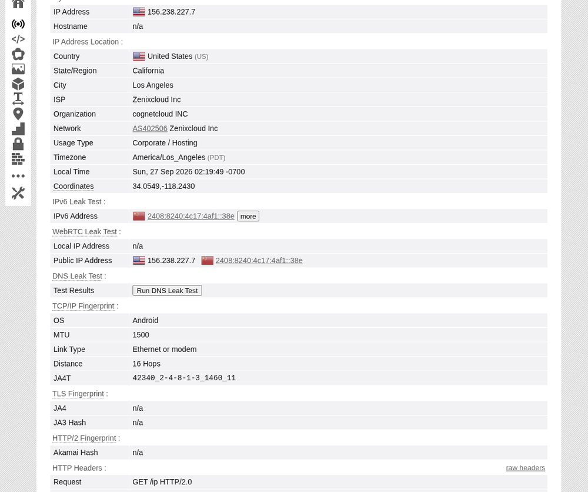
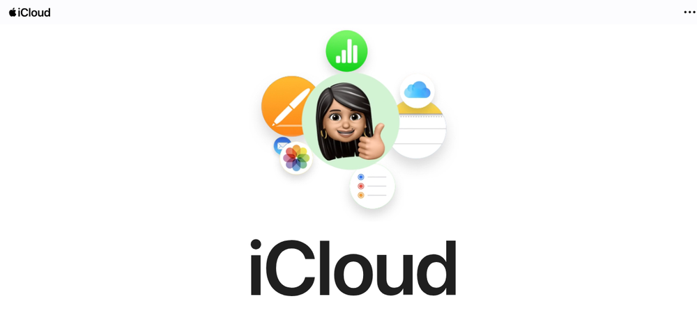
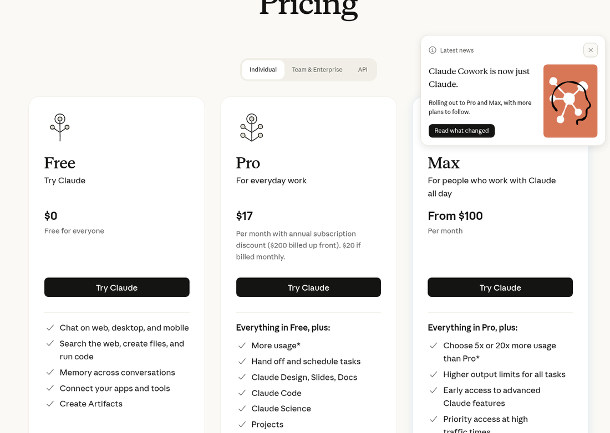

> **本文整理自**：
> - [蔚蓝WEILANX ·《虚拟卡被拒、代充封号之后，我终于找到了订阅 Claude 最省心的办法》](https://x.com/zurea255062/status/2103672988524855361)
> - [余温 ·《被 Claude 封了 N 次之后，我终于搞定了全套海外基础设施》](https://x.com/gkxspace/status/2101993381303820704)
>
> 过去一年里，为了用上并稳定续费 Claude Pro/Max，国内用户基本把能踩的雷全踩了一遍：虚拟卡频繁拒付还扣开卡费、找淘宝/闲鱼代充被黑卡连坐封号、裸连节点反复跳 IP 导致账号秒封、用买来的批量邮箱一注册就阵亡……
>
> 本文将两位作者一线摸爬滚打几个月的实战经验重新提炼重组，抛弃所有割韭菜的中间商话术，从**风控机理**、**硬件与网络环境**到**官方合规订阅链路**，一次性讲透最稳妥的保姆级落地方案。



---

## 目录

1. [一、底层认知：Claude 的风控到底在查什么？](#一底层认知claude-的风控到底在查什么)
2. [二、设备层：被封过多次的旧电脑如何彻底清理指纹？](#二设备层被封过多次的旧电脑如何彻底清理指纹)
3. [三、网络与时区：比选节点更重要的是“断网保底”](#三网络与时区比选节点更重要的是断网保底)
4. [四、账号准备：干净的邮箱与接码选型](#四账号准备干净的邮箱与接码选型)
5. [五、终极订阅闭环：美区 Apple ID + 礼品卡内购](#五终极订阅闭环美区-apple-id--礼品卡内购)
6. [六、备选方案：海外实体借记卡（Starryblu）](#六备选方案海外实体借记卡starryblu)
7. [七、日常使用行为的“保命”守则](#七日常使用行为的保命守则)

---

## 一、底层认知：Claude 的风控到底在查什么？

很多人问：“为什么我朋友用几块钱的垃圾机场裸连半年没事，我买的几百块专线节点两天就被封了？”

**核心真相：Anthropic 的封号机制是一个“加权打分模型”，从来不是因为某单一因素。**



风控系统会在后台实时综合评估你身上散发出的所有信号：
- **网络层**：IP 是否为数据中心托管（Hosting）机房 IP？ASN 是不是知名机房？是否被多人共用？
- **环境层**：浏览器 WebRTC 有没有泄露真实局域网 IP？系统时区是 Asia/Shanghai 还是美国/台湾本地时间？
- **支付层**：卡号 BIN 码是不是臭名昭著的被滥用虚拟卡段？账单地址和当前请求 IP 距离跨越半个地球？
- **行为层**：刚注册成功 5 分钟内是不是立刻拉满 20x Max 疯狂刷 Token？历史有没有多次触碰安全限制？

当这些异常因子的加权累加值突破系统设定的阈值，账号就会被系统标记，通常在下一次风控扫描时静默封禁。

因此，**我们要做的不是赌哪一个环节没被查，而是把每一个维度的信号全部做“干净”，让自己在 Anthropic 眼里看起来就是一个普普通通的海外本地自然人。**

---

## 二、设备层：被封过多次的旧电脑如何彻底清理指纹？

如果你的电脑此前已经连续被封过 2~3 个 Claude 账号，Anthropic 的前端 SDK 很可能已经记录了这台机器的本地指纹与身份凭证。直接在同一台电脑上注册新号，往往“一出生就带着黑名单标记”。

在换设备之前，务必按如下步骤彻底扫除本地残留：

### 1. 深度清理本地文件与凭证（以 macOS 为例）

1. **清理本地缓存目录**：
   ```bash
   rm -rf ~/.claude
   rm -rf ~/Library/Application\ Support/Claude
   rm -rf ~/Library/Caches/com.anthropic.claude*
   ```
2. **清理钥匙串（Keychain）残留**（极其容易被忽略！）：
   打开系统自带的「钥匙串访问」（Keychain Access），在右上角搜索 `Claude` 以及 `Anthropic`，将搜索到的所有密钥对、认证 Token 全部手动右键删除。
3. **清理浏览器指纹与 Storage**：
   使用全新的 Chrome 独立 Profile（或者无痕模式），彻底清理 `claude.ai` 和 `anthropic.com` 的 LocalStorage、Cookies 以及 IndexedDB。

---

## 三、网络与时区：比选节点更重要的是“断网保底”

### 3.1 时区设置：杜绝明显的时区倒挂

不要顶着中国标准时间（UTC+8，Asia/Shanghai）去访问一个美国机房的节点。
- **推荐策略**：将手机和电脑的系统时区统一改成节点对应地区（例如使用美西节点改成 `America/Los_Angeles`；如果图日常看表方便，可统一选择 **台北时间（Asia/Taipei）**，台湾属于 Claude 官方合规支持地区，且刚好没有时差）。
- 手机端务必关掉「基于位置自动设置时区」。

### 3.2 节点纯净度自查

使用数据中心机房 IP（Hosting）访问是触发第一道风控的大忌。可以用 [IPinfo](https://ipinfo.io/) 与 [BrowserLeaks](https://browserleaks.com/ip) 检查你的出口 IP：



关注重点指标：
- **`type` 字段**：如果是 `hosting`（机房），风控敏感度远高于 `isp` / `residential`（原生家庭宽带）。
- **`privacy` 字段**：`vpn`、`proxy`、`tor` 是否被各大商业数据库标记为 `true`。



务必在 BrowserLeaks 上检查：
1. **WebRTC Leak**：是否泄露了本地网卡的内网 IP 或国内公网 IP。
2. **DNS Leak**：DNS 解析服务器是否落在了国内运营商（如 114.114.114.114 或 223.5.5.5）。

### 3.3 最关键原则：“断网保底”，绝不自动切直连

很多人平时用着很稳，某天梯子节点抽风断连，客户端自动 Fallback 切换到了“直连”模式——Claude 服务端在毫秒级内看到同一个会话的 IP 瞬间从美国瞬移到了大陆直连，当场暴毙。

**分流规则防线**：
1. 在 Clash / Surge / Quantumult X 中，将 `DOMAIN-SUFFIX,claude.ai` 和 `DOMAIN-SUFFIX,anthropic.com` 强制绑定到固定的代理策略组。
2. 策略组的兜底规则必须是 **REJECT**（断网），而不是 DIRECT（直连）！宁可节点挂了让网页直接报错打不开，也绝不允许任何一条请求直接撞向国内网络。

---

## 四、账号准备：干净的邮箱与接码选型

### 4.1 邮箱策略
- **首选**：自己新注册、或者使用了半年以上的个人专用 **Gmail**。
- **次选**：个人独享域名的海外企业邮箱、ProtonMail。
- **严禁使用**：
  - 淘宝/发卡网几毛钱买来的批量注册临时 Gmail（早就被挂在撞库黑名单里）。
  - 国内 163、QQ 邮箱（部分甚至收不到验证码，且本身就是非合规地区的直接强信号）。

### 4.2 手机号接码
注册 Claude 必须提供一个海外手机号接收短信：
- 推荐使用海外实体 SIM 卡（如英国 giffgaff、莱卡等，成本极低，长久保号）。
- 如果使用接码平台（如 SMS-Activate），尽量选择英、美、日等成熟地区的**非虚拟号运营商（Non-VoIP）**。

---

## 五、终极订阅闭环：美区 Apple ID + 礼品卡内购

这是经过无数人半年以上实测验证、**封号概率最低、最省心**的正道：

> **核心逻辑**：
> 1. 自己在苹果官网注册干净的美区 Apple ID；
> 2. 官方渠道购买正版 Apple 礼品卡充值进账户余额；
> 3. 在 iOS 设备的官方 Claude App 内发起订阅，走苹果内购（IAP）走账。

**为什么这条链路最稳？**  
在 App Store 内购中，钱是你自己的正规礼品卡充入的，扣款和发票全由苹果处理，Anthropic 拿到的只是苹果结算的订阅凭证。整条链路没有可疑的代充信用卡，杜绝了由于别人黑卡退款导致连坐封号的风险。



### 步骤 1：搞一个属于自己的美区 Apple ID

**不要在买号网站买共享号！** 自己注册成本为 0：
1. **入口避坑**：去 `appleid.apple.com` 注册常遇到“此时无法创建”，改走 **[iCloud.com](https://www.icloud.com/)** 的登录页点“创建 Apple 账户”，成功率极高。
2. **网络设置**：注册 Apple ID 期间**把所有代理关闭，使用正常直连网络**。
3. **信息填写**：国家和地区选“美国”，姓名随意，邮箱使用一个从未绑定过 Apple ID 的全新邮箱。
4. 手机号直接填你自己的大陆 +86 手机号即可，苹果完全允许。
5. 注册成功后，在 iPhone 的 App Store 里退出当前账号，登录这个新美区账号，随便下载一个免费应用，根据提示补全免税州地址信息（免税州如俄勒冈 Oregon、特拉华 Delaware，邮编可通过网上免税州地址生成器获取）。

### 步骤 2：正规渠道购买 Apple 礼品卡充值

- **正规渠道**：支付宝内搜索“出海找小宝”/境外礼品卡，或者在 Amazon 美亚、苹果官网直接用国内双币信用卡买美区电子礼品卡（E-mail Delivery）。
- **必须留富余金额**：Claude Pro 定价为每月 $20。由于部分地区可能存在税费，**千万不要卡着整 $20 充值**！一旦加上税费变成 $20.x 导致扣款失败，账号会进入“账单异常”状态。建议首次充值 **$22 ~ $25**。

### 步骤 3：App 内订阅与立刻关闭自动续费



1. 在美区 App Store 搜索下载 **Claude by Anthropic**（注意开发者名字必须是 `Anthropic`，警惕山寨套壳高仿应用！）。
2. 打开 App 登录你的账号，点击 Upgrade to Claude Pro（或 Max 5x）。
3. 弹出 iOS 原生系统支付弹窗，核对扣款账户是否为美区 Apple ID 余额，双击电源键刷脸支付，权益秒到账。

> ⚠️ **强烈建议：订阅成功后，立刻前往关闭自动续费！**  
> **路径**：`App Store → 右上角头像 → 订阅 → Claude → 取消订阅`。  
> **原因**：取消自动续费后，你已支付的当月会员权益依然完整有效，整整 30 天一天不少。这么做能防止哪个月忘了充礼品卡导致扣款失败触发苹果账单拦截。次月需要继续用时，手动充值再点一下续订即可。

---

## 六、备选方案：海外实体借记卡（Starryblu）

如果你没有 iOS 设备、只能纯在网页端刷卡，市面上泛滥的虚拟卡（如各类 Depay、OneKey 衍生卡段）大部分已被 Stripe 和 Anthropic 拉黑。

目前门槛最低且较为稳定的替代方式是办理海外真实实体卡（如新加坡的 **Starryblu** 或个人境外银行卡）：
- **注意要点**：实体卡所属国家是哪里，订阅绑卡的那一刻节点就必须切到对应国家（如新加坡卡切新加坡节点），否则必触发账单地与请求地不符的风控拦截。
- 绑定成功后，后续月度自动扣款通常不再受 IP 变动影响。

---

## 七、日常使用行为的“保命”守则

环境和支付都跑通后，日常使用也要保持合规习惯：

1. **不要一上来就拉满最高负载**：新号开通后，建议先从日常对话、写写代码用起。如果需要上 Max 5x 或 20x，尽量使用 3~5 天后再逐步平滑升级，避开“刚注册就高频刷大 Token”的机器人特征。
2. **不要频繁跨国漂移**：今天在美西、下午跳日本、晚上跑英国。尽量固定在一条纯净的专线节点上。
3. **重要工作流自己留好备份**：无论你的配置做得多完美，由于身处未合规支持区域，始终存在极小概率的风控波及。重要对话生成的长代码、核心 Artifacts 随手备份到本地 Obsidian 或 Git 仓库中，鸡蛋不要放在一个篮子里。

---

## 结语

折腾海外基础设施就像搭积木：**底座的设备清理、中层的网络防漏，再加上顶层的苹果正规内购通道**，只要每一环都按真实海外用户的行为轨迹去合规构建，Claude 并不难伺候。

告别随时可能跑路的二手代充，把工具的主动权牢牢掌握在自己手里！
