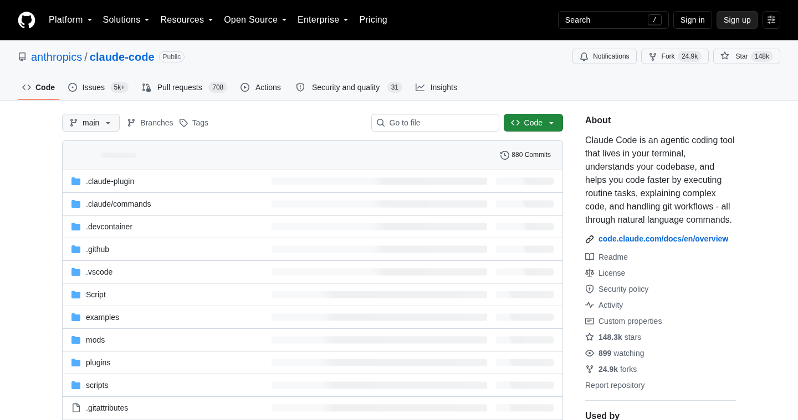
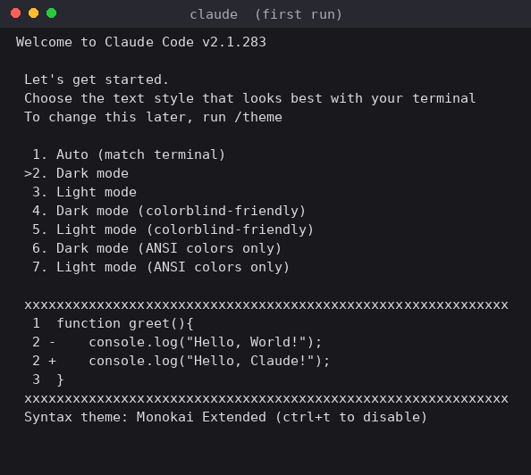
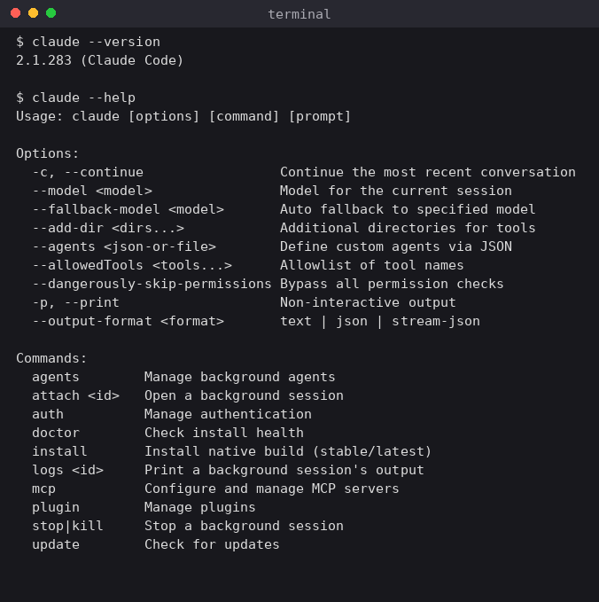
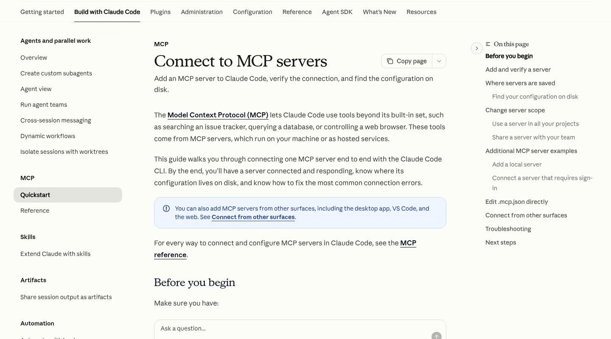
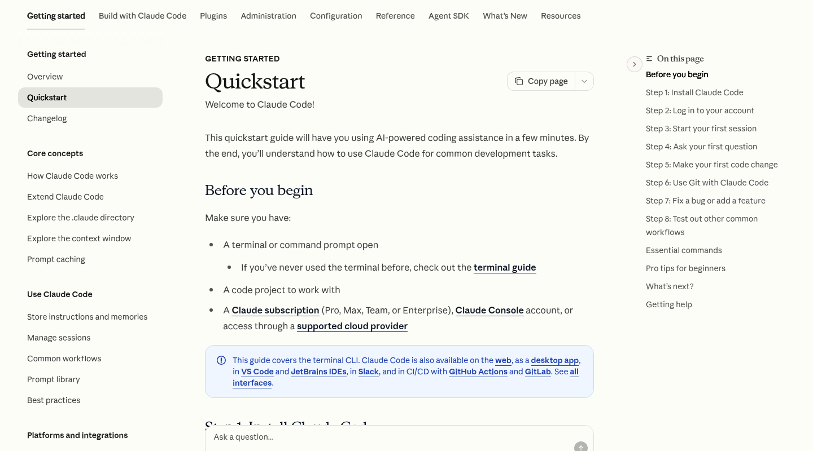
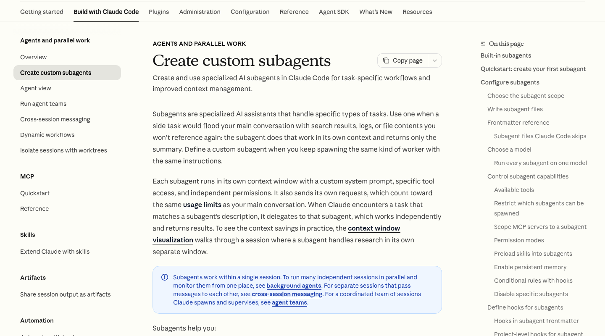
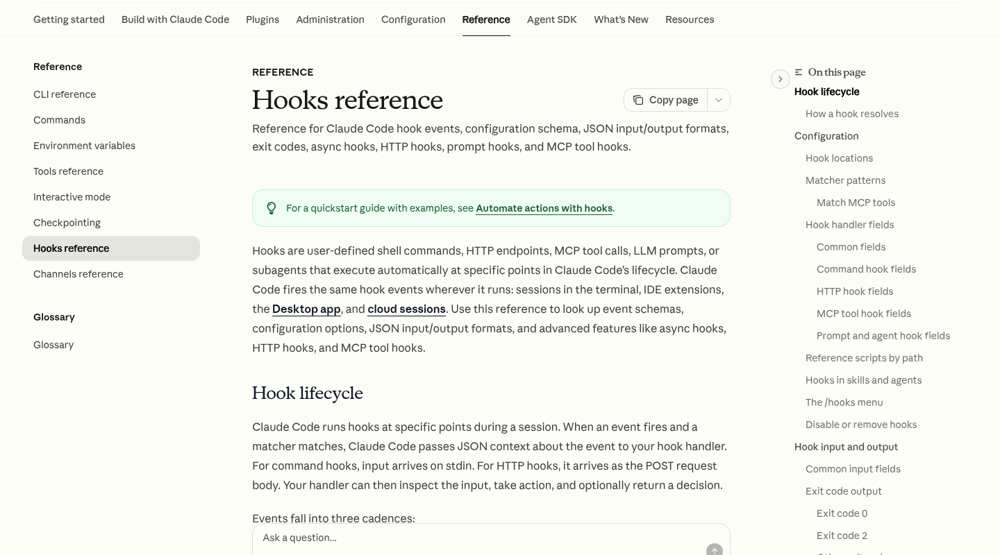
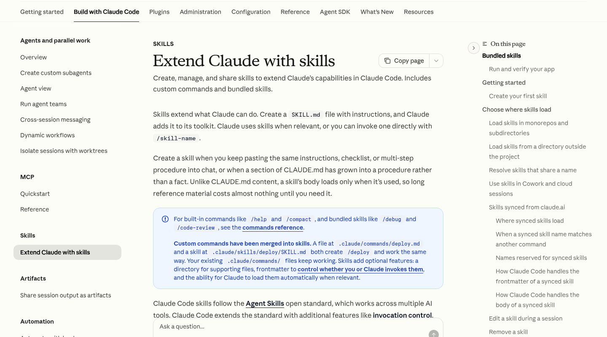
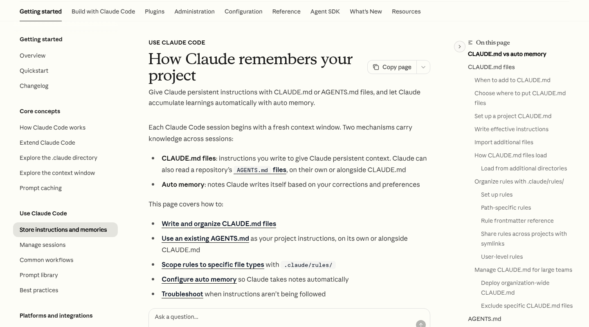

> 本篇所有 CLI 输出、版本号、界面截图均来自我在本机（Linux）实际安装运行的 Claude Code v2.1.283，文档内容对照官方文档 `code.claude.com/docs` 整理。和之前那篇 [Codex 桌面客户端教程](/posts/codex-desktop-app-guide/) 是同一赛道的不同选手，两者的心智模型我在文末做了对比。



## Claude Code 是什么，跟网页版 Claude 有什么区别

一句话：**Claude Code 是跑在你自己终端里的编程 Agent**，官方定位从 2025 年的"CLI 工具"已经演进成"多界面 Agent 平台"——同一个内核，你可以在终端 TUI、VS Code / JetBrains 插件、桌面 App、Web 会话、Slack、GitHub Actions 里用它，甚至用 SDK 把它嵌进自己的程序。

和网页版 Claude 聊天最大的区别有三个：

1. **它有手**：能直接读写你的项目文件、执行 shell 命令、跑测试、提交 git——不是给你贴代码让你自己复制。
2. **它有项目记忆**：通过 `CLAUDE.md` 和自动记忆系统，它知道你的代码规范、架构约定，跨会话不丢。
3. **它能被编排**：Subagents、Agent Teams、Hooks、Skills 这套扩展体系，让它从"一个助手"变成"一条流水线"。

对国内用户还有一个现实问题：**账号和订阅**。Claude Code 本身免费安装，但要用得有 Claude 订阅（Pro/Max）或 Console（API）账号。封号风险与规避我在 [Claude 防封号与订阅指南](/posts/claude-anti-ban-and-subscription-guide/) 里专门写过，建议先看那篇再回来。

## 第一步：安装与登录（本机实测）

官方推荐脚本安装，一行命令：

```bash
curl -fsSL https://claude.ai/install.sh | bash
```

国内网络直连 `claude.ai` 偶尔 TLS 握手失败（我就失败了一次），多试一次或挂代理即可。装完二进制在 `~/.local/bin/claude`：

```bash
$ claude --version
2.1.283 (Claude Code)
```

也可以用 npm 全局装（`npm install -g @anthropic-ai/claude-code`），但官方原生构建更新更快，推荐脚本方式；后续升级用自带命令 `claude update` 就行。

登录两种路径：

- **订阅用户**：运行 `claude` 后按提示走 OAuth，浏览器打开 claude.ai 授权，全自动，token 会存在系统 keychain 里。
- **API 用户**：`export ANTHROPIC_API_KEY=*** 环境变量，或者跑 `claude setup-token` 生成一个长期 token（CI 场景常用）。

查看当前登录状态：`claude auth status`；退出：`claude auth logout`。

首次进入交互界面会让你选主题（这版还是经典的黑底欢迎页，带语法配色预览）：



进目录就干活：`cd 你的项目 && claude`。如果这台机器以后都不打算用，装完记得 `claude auth logout`。

## 交互模式速查：会话、恢复、权限

启动后就是全屏 TUI。核心概念就四个，先记住：

| 操作 | 命令 | 说明 |
|---|---|---|
| 继续上次会话 | `claude -c` | 在当前目录接着最近一次对话 |
| 挑选历史会话恢复 | `claude --resume` | 列出本项目所有会话供选择，支持 `--fork-session` 分叉 |
| 上下文快满了 | `/compact` | 压缩历史保留要点；`/clear` 直接清空 |
| 看它"记得什么" | `/context` | 实时显示 CLAUDE.md、rules、memory 占用情况 |

常用斜杠命令还有：`/init`（扫项目自动生成 CLAUDE.md 初稿）、`/model`（切换 Opus/Sonnet/Haiku）、`/memory`（编辑记忆文件）、`/agents`（管理 Subagents）、`/hooks`（配置钩子）、`/mcp`（MCP 服务器状态）、`/doctor`（体检）、`/statusline`（自定义底栏）。

**权限模型**是新手最需要理解的一件事。默认模式下 Claude 每次要改文件、跑命令都会弹出确认；你可以：

- 单次允许 / 总是允许（选后者会写进 `.claude/settings.json` 的 allow 规则）
- `Shift+Tab` 循环切换权限档：普通 → **Plan Mode**（只读，先出方案不动手）→ **Accept Edits**（自动接受文件编辑）
- 彻底放手：`claude --dangerously-skip-permissions`——名字里写明白了，这是"危险模式"，只建议在无互联网的沙箱里用（比如容器里跑批量任务）。裸机直接开这个等于给 AI 免密 sudo。

`claude --help` 的关键参数一览（本机真实输出摘录）：



## CLAUDE.md 与记忆体系：项目级"入职培训"

这是 Claude Code 和所有"聊天式编程"拉开差距的地方：**持久化项目上下文**。官方文档把记忆分成两层：

| | CLAUDE.md（你写） | Auto Memory（它写） |
|---|---|---|
| 内容 | 指令和规则 | 学到的经验和模式 |
| 范围 | 项目 / 用户 / 组织 | 每仓库，跨 worktree 共享 |
| 加载 | 每次会话 | 每次会话（前 200 行 / 25KB） |

CLAUDE.md 有四级作用域，就近叠加：

1. **Managed policy**：`/etc/claude-code/CLAUDE.md`——公司 IT 统一部署的合规规则
2. **User**：`~/.claude/CLAUDE.md`——个人偏好，所有项目生效
3. **Project**：`./CLAUDE.md` 或 `./.claude/CLAUDE.md`——进 git，团队共享
4. **Local**：`./CLAUDE.local.md`——写进 `.gitignore`，只对你当前项目生效（放沙箱地址、测试数据之类）

实战建议：`/init` 生成的初稿只是起点，好的 CLAUDE.md 是**短而具体**的——"测试用 `npm test -- $FILE` 跑单文件"这种可执行约定，比"写高质量代码"有用一百倍。超过约 1000 行会稀释效果，官方推荐拆到 `.claude/rules/` 目录：

```
.claude/
├── CLAUDE.md
└── rules/
    ├── code-style.md
    ├── testing.md
    └── security.md      # 每个文件可带 paths: frontmatter，只在碰到匹配文件时加载
```

还支持 `@path` 导入语法（`@README`、`@docs/git-instructions.md`），以及**路径级规则**——rules 文件头部写 `paths: ["src/api/**/*.ts"]`，只有 Claude 碰这些文件时才注入对应规则，省 token 又精准。

## Subagents：给 Claude 配一个"专科医生"团队

Subagent 是**独立上下文窗口 + 自定义系统提示 + 限定工具集**的专职助手。跟主会话的关系：主 Claude 遇到匹配任务时派活给它，它干完只回传结论，中间的搜索、读文件的噪音不污染主上下文——这就是它解决"长会话降智"的核心机制。

创建方式官方现在推荐直接说话："给 ~/.claude/agents/ 建一个 code-reviewer 子代理，只读工具，用 Sonnet"，它会生成标准文件：

```markdown
---
name: code-reviewer
description: Reviews code for quality and best practices
tools: Read, Glob, Grep
model: sonnet
---

You are a code reviewer. When invoked, analyze the code and provide
specific, actionable feedback on quality, security, and best practices.
```

存放位置决定作用域（优先级从高到低）：managed settings → `--agents` CLI 参数 → `.claude/agents/`（项目）→ `~/.claude/agents/`（个人）→ 插件目录。另外新版内置了 `Explore`（快速只读搜索，Haiku 驱动）和 `Plan` 两个官方 subagent，你让它"先调研这个项目"时它们会自动上场。

## Agent Teams vs Subagents：2026 年最重要的概念区分

2026 年 2 月正式上线的 **Agent Teams** 是另一个量级的东西：**多个完整 Claude Code 实例组成团队**，一个 session 当 Team Lead 负责拆解分派，Teammate 之间可以**互相直接发消息**（通过 `~/.claude/teams` 下的 JSON inbox），不用事事经过 lead 转发。

| | Subagents | Agent Teams |
|---|---|---|
| 运行位置 | 同一 session 内派生 | 多个独立 session |
| 上下文 | 共享主会话调度 | 各自独立，可互发消息 |
| 适合 | 调研、审查类"一问一答" | 前端+后端+测试并行开发的"项目组" |
| 成本 | 可控 | **非常烧 token** |

官方也明确建议：能用 subagents 或跨会话消息解决的，不要开 team。社区实测最常见的组合是"架构师 lead + 前后端 teammate + 安全审查 teammate"，跑并行 code review 或大型重构。想玩的话注意钱包。

## Hooks：不靠模型自觉的流程纪律

CLAUDE.md 里的规则本质是"提示词"，模型偶尔会忘；**Hooks 是代码**——在生命周期节点强制执行 shell 命令 / HTTP / MCP 调用 / LLM 判断，100% 触发。

配置在 `settings.json`，核心结构是"事件 → matcher → 命令"：

```json
{
  "hooks": {
    "PostToolUse": [
      {
        "matcher": "Edit|Write",
        "hooks": [{ "type": "command", "command": "npx prettier --write \"$CLAUDE_FILE_PATHS\"" }]
      }
    ]
  }
}
```

关键事件：`PreToolUse`（工具执行**前**，退出码 2 可直接拦截）、`PostToolUse`（执行后，比如自动格式化）、`SessionStart`（注入环境）、`UserPromptSubmit`（给每轮提问追加上下文）、`Stop`（响应结束提醒/通知）、`PreCompact`。官方文档给的安全场景很典型：用一个 `PreToolUse` 脚本拦 `git push --force`，或者给"只读数据库分析师" subagent 挂个校验脚本，见到 INSERT/UPDATE/DROP 就 exit 2 阻断——**把安全边界从"提醒模型"变成"物理隔断"**。

## Skills：把团队 SOP 变成可复用的 /命令

Skills 是带 YAML frontmatter 的 Markdown 文件夹（`.claude/skills/名字/SKILL.md`），描述匹配时模型自动加载，也可以 `/名字` 手动触发。适合沉淀"PDF 表单处理""API 联调 checklist""发版流程"这类多步骤规范流程，还能附带脚本和模板文件。跟 CLAUDE.md 的分工：CLAUDE.md 管"这个项目是什么样"，Skill 管"这类任务怎么干"。多个 skill + subagent + MCP 打包分发，就是 Plugins 生态（`claude plugin` 命令管理，官方有插件市场）。

## MCP：外接全世界

Model Context Protocol 让 Claude Code 连数据库、浏览器、内部 API。添加服务器一条命令：

```bash
claude mcp add postgres -- docker run -i --rm mcp/postgres
```

按作用域分 local（只在本项目对你可见）/ project（写进 `.mcp.json`，团队共享）/ user（你的所有项目）。会话里 `/mcp` 看状态和 OAuth 授权。给 Claude 接上 Playwright MCP 后它可以真的开浏览器验证自己写的页面，接 GitHub MCP 后可以查 issue 直接开工——这是它从"改代码工具"变成"全自动打工人"的接口层。



## 后台 Agent 与无头模式：不止人在电脑前才干活

v2.1 之后 `claude` 长出了一组后台命令，这是很容易被忽略但生产力提升最大的部分：

```bash
claude --bg "重构 payment 模块并补测试"   # 立刻返回一个会话 id
claude agents                          # 列出所有后台会话
claude attach 3a2f1b                   # 拉回当前终端围观
claude logs 3a2f1b                     # 看最近输出
claude stop 3a2f1b                     # 停掉（对话保留，可再 attach）
```

再配合 `-p`（print）无头模式，就能进 CI 和脚本：

```bash
claude -p "审查这个分支的改动，只报高置信度问题" \
  --output-format stream-json --max-budget-usd 5
```

`--json-schema` 可以强制结构化输出方便下游程序解析，`--fallback-model` 在主力模型过载时自动降级。官方还给了 `claude ultrareview`——云端多 agent 对整个分支做代码审查直接打印 findings。加上 GitHub Actions（`/install-github-app`）和 GitLab 集成，PR 评论 @claude 派活是现成玩法。

## 成本、模型选择与防封号提醒

- **模型策略**：日常编辑/查代码用 Sonnet 足够，省 60%+ 开销；架构设计、疑难 bug 再切 `/model` 到 Opus；批量后台任务可以考虑 Haiku。`/usage` 看当前周期用量。
- **订阅 vs API**：有 Max 订阅用 OAuth 登录最划算（额度固定）；API 按量计费适合脚本和 CI，但要设 `--max-budget-usd` 兜底。
- **账号安全**：Claude Code 的 OAuth 流量走官方域名，风险远低于网页端频繁切换出口 IP；但**共享账号、多设备高频并发、IP 频繁跳变**照样可能触发风控。API key 永远不要提交进 git（`.claude/settings.local.json` 记得 gitignore）。
- **第三方网关**：走中转站/代理网关的 `ANTHROPIC_BASE_URL` 方案能绕过账号问题，但代码会经过第三方服务器，商业项目慎用。

## 学习路径：从官方文档到实战

官方文档站这两年做得很系统，三个页面按顺序读收益最大：











建议顺序：① Quickstart 八步走通一次真实小需求 → ② `/init` 生成 CLAUDE.md 并手动删到 30 行以内 → ③ 给项目加一个 pre-commit 式的 PostToolUse hook → ④ 建一个 code-reviewer subagent 每次改完自动审 → ⑤ 需要外部系统再上 MCP → ⑥ 最后才碰 Agent Teams（成本意识放在能力前面）。

## 最后：和 Codex 桌面版怎么选

两者 2026 年都已不是"编辑器补全"物种。经验之谈：**重度终端用户 / 已有 Claude 订阅 / 要细粒度控制 hooks 和 subagents** → Claude Code；**要图形界面、多任务看板、自动化 cron、跟 OpenAI 生态（Sheets/Docs/Slack）集成** → Codex 桌面版（见[这篇](/posts/codex-desktop-app-guide/)）。真实团队里两个都挂着并不罕见——毕竟它们唯一共同点，是都怕你只看不干。
