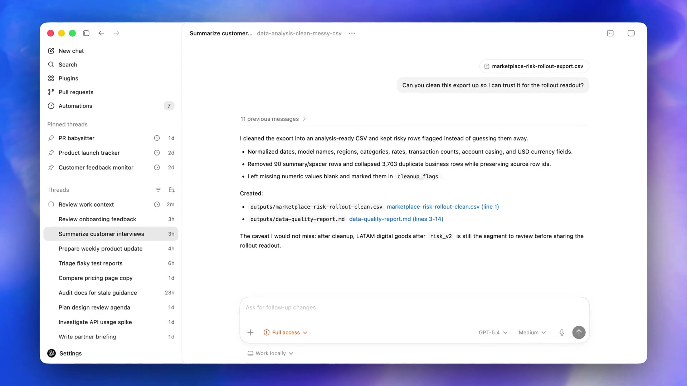
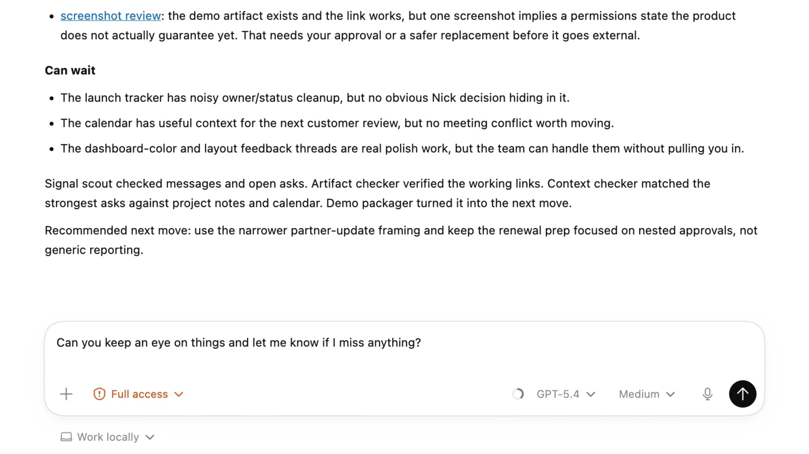
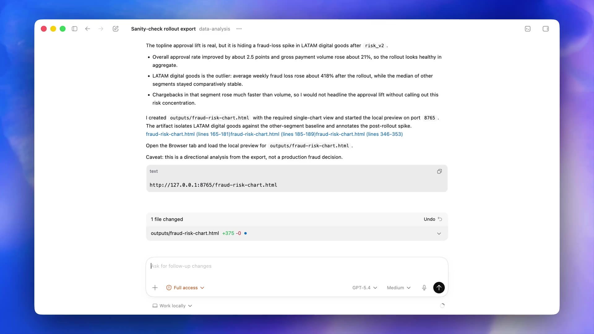
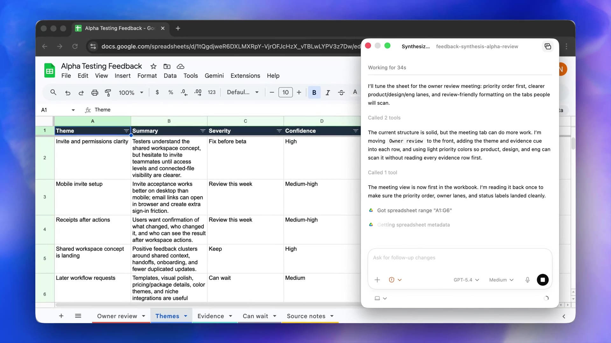
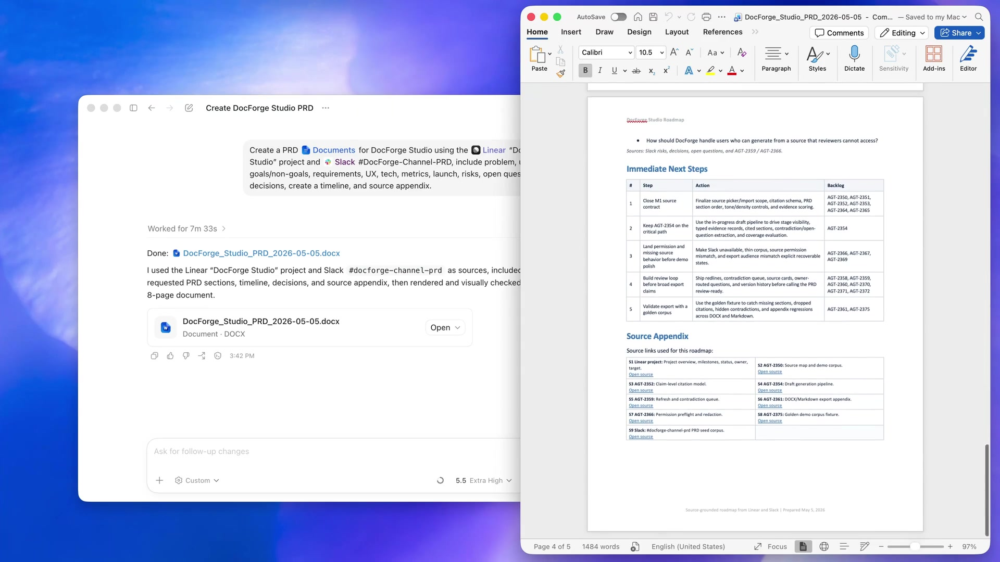

> 文中界面截图均截取自 OpenAI 官方文档站的演示视频（developers.openai.com / learn.chatgpt.com 官方 CDN），非第三方转载、非 AI 生成。产品迭代很快，具体入口以你本机最新版为准。

## 写给谁、解决什么问题

OpenAI 的 Codex 现在有四种形态：Web 云端版、CLI 命令行、IDE 扩展，以及今天的主角——**桌面客户端（Codex App）**。

CLI 强大但门槛高，IDE 插件离代码近但离"任务"远，Web 版适合挂机跑需求但不碰你本地文件。桌面 App 把三者拼成了完整闭环：**它以你本机的项目目录为根据地，同时调度多个 Agent 并行干活，产出可以直接审查、提交、开 PR，还能操作浏览器和桌面软件、定时执行任务、生成文档表格**。

2026 年 2 月它率先登陆 macOS，3 月 Windows 跟进；7 月起官方把 Codex App 并入了新版 ChatGPT 桌面客户端（一个 App 内含 Chat / Work / Codex 三块，老 Codex App 直接升级即得，Codex 可设为默认启动视图并保留独立图标）。所以你在下载页看到 "ChatGPT desktop app" 别困惑——**里面那个 Codex 视图，就是本文说的 Codex App**。

一句话判断你该不该用：如果你想"布置任务而不是陪写代码"，桌面客户端是目前 Codex 全家桶里最强的形态。

---

## 一、安装：三个平台各走各的路

### macOS（Apple Silicon）

1. 官方下载页 `openai.com/codex` 点击 Download for macOS，拿到 `Codex.dmg`（约 300+ MB）；
2. 双击挂载，把 App 拖进 Applications；
3. Spotlight 搜 `Codex` 启动。

Intel Mac 不再支持，必须是 M 系列芯片；系统建议保持较新版本。

### Windows

主路径是 **Microsoft Store** 搜索 "Codex"（认准 OpenAI 发布者）安装；企业环境也可以用 `winget` 装，本质上还是从 Store 源拉取。要求 Windows 10（19041+）或 Windows 11，64 位。首次启动如果闪退，通常是缺 Visual C++ 运行库，补上即可。

Windows 版有一个独有优势：**原生沙箱（Windows Sandbox）支持**，Agent 执行命令被系统级隔离，这点后面权限章节细说。

### Linux

官方目前提供的是安装指引页（docs 里 "Install on Linux"），走的是 ChatGPT/Linux App 通道；不便之处是部分桌面特性节奏略滞后，重度用户可以先用 CLI 顶住，App 与 CLI 共享同一套配置和历史。

### 安装后第一件事：升级

这类迭代以周计的产品，装完先检查更新（macOS 菜单栏 / Windows Store 更新页）。并入 ChatGPT 桌面端后，老 Codex App 内的项目、线程、设置都会原样保留，不用担心迁移丢失。

---

## 二、登录与计费：ChatGPT 账号优先，API Key 是备胎

启动后两条路：

| 方式 | 优点 | 缺点 |
|---|---|---|
| **ChatGPT 账号登录**（Continue with ChatGPT，跳浏览器 OAuth） | 订阅内含 Codex 全部功能：本地 Agent + 云端任务 + 手机远程；额度池统一 | 依赖订阅档位 |
| **API Key**（platform.openai.com 生成） | 按 token 计费，适合已有 API 预算的团队 | 云端功能、手机远程等部分特性不可用 |

订阅档位现状：Plus / Pro / Business / Enterprise / Edu 均可用；官方还曾面向 Free / Go 限时开放并给付费档加倍速率。普通个人开发者一张 Plus（$20/月）就是起步配置，重度并行任务或多 Agent 常驻建议 Pro。

登录环节两个高频坑：

- **浏览器 OAuth 卡住**：检查默认浏览器能否正常访问 OpenAI（国内环境需要稳定的国际网络出口，这个"环境"问题建议配合干净住宅 IP 使用，频繁风控切 IP 反而危险）；
- **设备码登录注意防钓鱼**：新版登录会显示校验提示，确认 App 与浏览器两端数字一致再授权。

Business/Enterprise 管理员可通过 managed policies 控制 App 内更新和权限档位，团队用户遇到某些入口"灰着"先问管理员，不是 bug。

---

## 三、界面导览：把每个区域掰开讲

先看主界面，信息密度其实不高，五分钟能认全：



对照上图，从上到下过一遍：

**左侧栏（指挥中心）**
- **New chat / Quick chat**：普通新任务 vs 轻量快问快答（不落项目上下文）；
- **Plugins / Scheduled（自动化）**：两个全局入口，后文专章；
- **Pinned**：置顶的常用线程，适合挂"盯 PR""周报流水线"这类常驻任务；
- **Projects → Threads**：一切围绕项目组织。一个 Project 绑定一个本地目录，项目下的每个 Thread 是一个独立对话+独立工作环境，可并行跑互不干扰；
- 底部 **Settings**：账号、权限、浏览器、Worktree、远程等所有开关的家。

**中间主区（任务进行时）**
- 头部显示线程名 + 绑定的仓库/分支标识，右侧有 **Open**（用外部编辑器打开工作目录）和终端图标（拉起集成终端）；
- 对话流里 Agent 把过程摊开给你看：`Thought 7s`（思考耗时）、`Explored 2 files`（探索了哪些文件）、`Edited hero.tsx +16 -6`（每个文件的增删行数）——每一行都可以点开看细节，这是"监工视图"而非黑盒。

**底部输入框（Compliance 三件套）**



发送前你实际在做三个决策：
1. **权限档位**（Ask for approval / Full access 等，详见第六章）；
2. **模型**（当前世代如 GPT-5.x 高推理档；模型名后的数字档位会随退役公告滚动更新，官方惯例是提前数月通知旧档任务需迁移）；
3. **推理力度**（Low/Medium/High/Extra High——日常任务 Medium 够用，架构设计、疑难 bug 上 High）。

输入框本身支持：**@** 调用插件或提及文件、**$** 显式点名某个 skill、拖拽文件/图片进上下文、麦克风语音输入、"+" 添加附件。

**右侧上下文面板**：任务运行中会浮出计划（Plan）、来源（Sources）、生成文件列表——随时打断纠偏的抓手。

---

## 四、第一个任务：从打开文件夹到收到第一份 diff

推荐流程（新手照抄即可）：

1. 侧栏 **New chat** → 选择已有项目或 **Open folder** 指向你的仓库目录；
2. 界面会提示 App 读取了该目录的 `AGENTS.md`（项目级说明书，CLI/IDE 时代的老朋友，App 完全兼容）；
3. 输入框左下角确认环境为 **Work locally**（本地模式，动真文件，但受沙箱约束）；
4. 权限选 **Ask for approval**（默认，最稳）；
5. 发一个边界清晰的任务：

```text
给 README 增加一段 Windows 安装说明，然后找出仓库里引用旧安装路径的文档并列出，先不要改。
```

6. 观察 Agent 探索 → 编辑 → 在消息流里给出改动摘要；
7. 在 **Code changes** 面板逐行看 diff，满意点 **Commit**，不满意点 **Undo** 或直接在输入框说"把第三段改回原来的口径"。

**任务描述的心法**：把"验收标准"写进 prompt。App 里的 Agent 经常一口气干十几分钟，你不可能全程盯着；"完成后跑 X 测试并把结果贴出来"这类指令会让产出可审查得多。

---

## 五、Worktree 并行：这个 App 的镇店之宝

多任务并行是桌面客户端区别于 CLI 的核心能力，而支撑它的是内置的 **Git worktree** 集成。

### 为什么需要它

Git 的默认世界里，一个工作目录同一时刻只能站在一个分支上。你想让 Agent A 重构支付模块、同时让 Agent B 升级依赖？没有 worktree 就只能排队，或者手动 stash/checkout 来回倒腾。

Codex 把这套操作全部自动化了：基于你选的分支，在 `$CODEX_HOME/worktrees` 下悄悄建一个独立 checkout，**每个线程独占一个 worktree，各自的文件、各自的编译缓存，共享同一个 `.git` 对象库**，多个 Agent 物理上不可能互相踩。



### 实操要点

- **开线程时选 Worktree**：composer 下方把环境切到 **Worktree**，再选基线分支（可以是带着未提交改动的当前分支——它会把你的脏改动一并带进 worktree，本地工作区保持原样）；
- 默认是 **detached HEAD** 状态，不占用任何真实分支；
- 干完活两条出路：
  1. **就地转分支**：线程头部 **Create branch here**，然后 commit、push、开 PR，全程不用碰本地 checkout；
  2. **Handoff 交接回 Local**：线程头部 **Hand off → Local**，Codex 自动处理两坑之间的 Git 搬运（分支独占、冲突规避），你把成果接回前台，在自己熟悉的 IDE 里继续；
- **持久 worktree**：项目右键三点菜单可以创建永久 worktree（当成独立项目用，不会被自动清理）；
- **磁盘配额**：Codex-managed worktree 默认只保留最近 **15 个**，超出的自动删除（删除前会打快照，误删可恢复）；`.gitignore` 里的文件不会随交接搬运，需要的话配置 `.worktreeinclude`。

### 什么任务适合并行丢出去

- 依赖升级、批量重命名、测试补全这类"改动可验证、互不依赖"的活；
- 实验性重构：一个 worktree 试方案 A，另一个试方案 B，谁赢合谁；
- 你自己前台继续开发，让 Agent 在后台 worktree 里修 lint——**这才是这个 App 的正确打开方式：你是 tech lead，它是你招的一组不限薪的初级工程师**。

---

## 六、权限与沙箱：敢放手的前提是围栏

App 提供三档常用权限（composer 里那个选择器）：

| 档位 | 含义 | 适用 |
|---|---|---|
| **Read only** | 只读浏览与问答，禁止一切写操作和命令 | 看代码、做调研 |
| **Ask for approval**（默认） | 工作区内自由改文件，但**执行命令需要你逐个批准** | 新项目、敏感仓库 |
| **Full access** | 自动执行命令、网络访问，不再逐步确认 | 你信任的任务环境（截图里橙色标识就是提醒你"现在是放开状态"） |

底下是平台原生沙箱在撑腰，不是口头承诺：

- **macOS**：系统级 Seatbelt 框架，进程出圈直接拦；
- **Windows**：原生 Windows Sandbox（PowerShell 环境）或 WSL2 内 Linux 方案；
- **Linux/WSL2**：`bubblewrap`（`sudo apt install bubblewrap` 装好，App 找不到会启动时警告）。

关键点：**Agent 派生的所有命令（git、npm、pytest……）都继承同一套沙箱边界**，网络默认关闭。高级用户可以在 `~/.codex/config.toml` 里定义自定义权限档（哪些目录可写、哪些路径永久 deny、网络代理策略），配置与 CLI 完全通用——一次编写，三端生效。

实操建议：日常 `Ask for approval` + 网络按需放开；定时任务无人值守跑之前，先把默认沙箱档位收紧到最小可用集。

---

## 七、Skills：把重复工作打包成"一键"

Skills 是 Anthropic 先提出、OpenAI 跟进并开放了标准（agentskills.io）的能力封装：一个文件夹 + 一份 `SKILL.md`（YAML frontmatter 写名称和触发描述，正文写流程），就能让 Agent 稳定按你的规程办事。

App 内建了完整的 Skills 管理界面，创建途径三条：

1. **$skill-creator**：直接在对话里召唤内置创建器，问答几轮生成骨架；
2. **Record & Replay**：你手工操作一遍流程，录制器解析步骤自动草拟成 skill——"说起来费劲、做起来顺手"的活最适合；
3. **手写**：`SKILL.md` 扔进约定目录（个人级 `~/.codex/skills/`，项目级 `.codex/skills/`，也能复用 `~/.claude/skills/` 里的存量），App 自动发现。

调用方式两种：`$` 显式点名，或者任务描述恰好命中 skill 的 `description` 时自动启用。写 `description` 的要领：**把触发场景词放最前面**，边界写清楚——自动匹配全靠它。

典型用法：把"公司 commit 规范 + 提交前必跑的检查清单"做成 skill，之后所有线程里一句 `$commit` 全部走完；把"竞品价格抓取 + 汇总到表格"做成 skill，配合下一章的定时任务就是全自动流水线。

---

## 八、Scheduled / Automations：不下班的 Agent

侧栏 **Scheduled** 是任务收件箱，支持两类定时任务：

- **独立定时任务**：每次触发开一个新线程，结果汇报进 Scheduled 列表（未读小红点提醒你看）；
- **线程内定时任务**：在现有对话里安排"每小时回来看一眼部署状态""每周一早上基于本线程上下文续跑"——复用当前上下文，适合长周期跟进。

配置要点：

- Git 项目可选**在专用后台 worktree 跑**（不污染你手头的活）或直接本地目录跑；
- 周期除了表单选项，支持 **RRULE 表达式**自定义（`FREQ=MONTHLY;BYMONTHDAY=1;BYHOUR=9` 这种），复杂排程无压力；
- 定时任务**无人值守执行，沿用你的默认沙箱档位**——再强调一遍，先收紧再放飞；
- 高频任务会积累大量 worktree，记得归档旧运行（归档即回收 worktree）。

官方的示范玩法很能打开思路：定时检查过去 24 小时自己的提交并触发 bugfix skill、每晚跑一次全量测试失败自动修复、PR 看守员（发现新 review 意见自动改并回复）。任务提示词写成**每次运行都自包含**的形态：做什么、如何判断有没有异常、什么情况停手来问我。

注意：需要本地文件的定时任务要求**电脑开机且 App 在运行**——想要 7×24 真无人值守，把任务放 Codex cloud 或者一台常开的旧笔记本上。

---

## 九、插件、内置浏览器与 Computer Use

### 插件体系

侧栏 **Plugins** 一屏管理，官方第一方 + MCP 第三方统一接入：GitHub、GitLab、Slack、Linear、Google 全家桶（Drive/Sheets/Docs）、Chrome 扩展、Computer Use……连接账号后即可在线程里 `@` 点名使用。MCP（Model Context Protocol）生态全面兼容，`config.toml` 里几行配置接入任意 MCP server。

### 内置浏览器

App 自带一个浏览器面板（自身独立 profile，不共享你 Chrome 的历史和登录态）。它不是给你摸鱼用的——是让 Agent 能**看见页面、操作页面、验证结果**：

```text
用浏览器打开 localhost:3000/settings，复现那个按钮溢出 bug，只修溢出的控件。
```

开发 Web 项目时这条链路非常关键：**改完代码 → 浏览器里实际渲染 → 截图对比 → 继续修**，视觉验证闭环不用切出 App。敏感动作（提交表单、购买、删数据）会强制弹确认；允许的网站清单在 Settings > Browser 管理。



### Computer Use：操作整个桌面

需要驱动**任何 GUI 软件**（iOS 模拟器、Photoshop、内部老系统）时，启用 Computer Use 插件：

- macOS：授予 **屏幕录制 + 辅助功能** 权限后可在后台干活，你继续写你的代码；
- Windows：在活跃桌面上前台操作，会接管鼠标键盘，跑任务时别抢。

典型场景：让 Agent 自己打开模拟器点点点回归测试、跨多个桌面应用搬数据、复现只在 GUI 出现的 bug。它是"浏览器覆盖不到的世界"的补刀件，权限也最大，用多少给多少。

---

## 十、Artifact 与文件生成：不止写代码

App 内置文档预览器，Agent 能直接产出 **Word / Excel / PPT / PDF / 图片 / HTML 报告**，在同一工作区里生成、预览、标注修改：



杀手锏是**批注式修改**：在渲染出的文档/网页/幻灯片上直接框选某一段，说一句"这段补个来源""图表配色太杂"，Agent 只改你圈中的部分。从 Slack/Linear/文档里聚合素材→生成 PRD→标注迭代→导出交付，全程不出 App。

配合图片生成 skill（GPT Image 驱动）和 `@` 拖入图片作为输入，做设计走查、竞品截图分析也顺路。

---

## 十一、生态联动：IDE 扩展与手机 Remote

**与会话历史全共享**：App、CLI、IDE 扩展读同一份 `~/.codex` 配置与线程记录——终端里开的任务，回到 App 里继续接手，反之亦然。

**IDE 扩展**（VS Code / Cursor / Windsurf / JetBrains）：设置里开启 **Auto Context** 后，桌面端自动感知你当前在 IDE 里打开的文件，问"这个文件是干嘛的"不用手动贴代码。

**手机 Remote**（出差/通勤神器）：
1. 桌面端 Settings → Connections → **Control this Mac or PC** 建立配对，手机 ChatGPT App 扫码；
2. 手机上选电脑和项目即可发起任务、**远程审批命令**、查看 diff 与测试结果；
3. 工作永远发生在你那台电脑上——手机只是指挥台。

排队中午的活儿让它在服务器上跑，下午到工位直接 review，是 Remote 的正确用法。Business/Enterprise 下所有动作受组织安全策略约束，合规团队可查。

---

## 十二、实战组合拳：三个可直接抄的工作流

**1. 早晨开工流水线（定时任务 + Skill）**
每周一定时线程：拉取上周 crash 日志 → 匹配 `$bugfix` skill 在独立 worktree 出修复分支 → 结果进 Scheduled 收件箱。你早上泡咖啡时挨个 review，合并三个已经写好的 PR。

**2. 前后端并行开发（Worktree 矩阵）**
同一仓库开三个线程：后台 worktree A 加 API（本地模式跑起服务给你验收）、worktree B 写前端组件（内置浏览器截图自查视觉）、你自己在 Local 写核心逻辑。谁也不等谁。

**3. 竞品周报（浏览器 + Computer Use + Artifact）**
一句话任务：浏览器逐个打开竞品 changelog → 无法自动化的页面用 Computer Use 操作 → 汇总要点生成一页 PPT → 圈注微调措辞 → 定时每周自动重跑。

---

## 十三、避坑清单（血泪浓缩）

1. **别拿 Full access 当默认档位**——图省事的代价在错误累积十几分钟后才爆炸；逐步审批打断有限，返工成本无限。
2. **定时任务的 prompt 必须每次自包含**——"接着上次继续"在线程内任务成立，独立任务里每次都是新线程，没这个上次。
3. **磁盘监控**：worktree × 项目依赖 = 复利式吞盘；默认留 15 个可以调小，定期归档旧线程。
4. **`.gitignore` 文件不随 Handoff 搬运**：本地 `.env` 这类要在 worktree 里重新准备，或用 `.worktreeinclude` 白名单。
5. **登录方式决定功能面**：API Key 登录没有云端任务和部分 App 特性，想用全家桶就 ChatGPT 账号登录。
6. **网络环境要稳定干净**：OAuth 中转掉一次就可能触发风控验证；共享"机场"IP 频繁变动的体验最差。
7. **模型退役通知要看**：旧模型（如 gpt-5.4 系）退役会波及存量定时任务，收到提示及时改选，否则任务静默失败。
8. **App 更新勤快点**：并入 ChatGPT 桌面端后功能以周为单位增加，很多"这个功能怎么用"的疑问，下个版本就有专门入口了。

---

## 结语

Codex 桌面客户端的本质，是把"Agent 驱动的开发"从 CLI 的极客仪式变成了**可视化、可并行、可托管的日常工作方式**：Worktree 给并行提供地基，权限沙箱给放手提供边界，Skills 和定时任务给复用提供载体，浏览器/Computer Use/Artifact 把能力从代码扩展到整个桌面。

它的学习曲线集中在前两周：权限档位怎么给、任务粒度怎么切、diff 怎么高效 review。翻过这个坡之后，你会发现自己的一天变成：早上一杯咖啡收 PR，白天给三个 Agent 派活纠偏，晚上下班前给明早的自己留一排定时任务。

**工具已经把"多 Agent 并行"的成本打下来了，剩下的只是你的任务想象力。**

---

*参考：OpenAI 官方文档 learn.chatgpt.com（Codex app / Worktrees / Scheduled tasks / Browser / Computer Use / Permissions / Sandboxing / Skills / Remote）、openai.com/index/introducing-the-codex-app 发布公告。截图来自 OpenAI 官方 CDN 演示视频抽帧。*
