> **本文整理自** [想风（@xaiwind）在 X 上的分享](https://x.com/xaiwind/status/2104039563719262546)，原文涵盖了作者多年摸爬滚打总结的 GitHub 实战心法。  
> 本文在原文基础上梳理了行文逻辑、补全了完整命令示例、核对了 2026 年 GitHub 免费配额与计费规则，并附上全部真实浏览器截图，方便大家收藏查阅。


很多人入门编程时卡在的第一道坎，不是写代码，而是“把代码弄到 GitHub 上”。有人以为装了 Git 就能直接 `push`，有人改完代码直接在网页端点“Upload files”，还有人为了清理项目顺手把 `.git` 当成缓存删掉——然后几个星期的提交全没了。

**GitHub 不是一个需要死记硬背的工具，只要摸清它的核心机制，日常开发真正高频用到的命令其实就几行。**

本文按新手由浅入深的真实使用链路，一步步讲透：

---

## 目录

1. [一、Git ≠ GitHub：搞混了后面每一步都会拧巴](#一git--github搞混了后面每一步都会拧巴)
2. [二、注册账号与 Git 本地环境安装](#二注册账号与-git-本地环境安装)
3. [三、四个概念走天下：仓库、提交、分支、远程](#三四个概念走天下仓库提交分支远程)
4. [四、推送认证：SSH Key 与 PAT 该怎么选？](#四推送认证ssh-key-与-pat-该怎么选)
5. [五、怎么看懂一个开源项目？](#五怎么看懂一个开源项目)
6. [六、高效搜索：精准找到你要找的仓库与代码](#六高效搜索精准找到你要找的仓库与代码)
7. [七、读懂源码：从哪一行开始看？](#七读懂源码从哪一行开始看)
8. [八、提你的第一个 PR：从 Fork 到被合并的标准姿势](#八提你的第一个-pr从-fork-到被合并的标准姿势)
9. [九、GitHub Actions：让云端机器人替你干活](#九github-actions让云端机器人替你干活)
10. [十、GitHub Pages：零成本搭建带 HTTPS 的静态博客与网站](#十github-pages零成本搭建带-https-的静态博客与网站)
11. [十一、七个代价最高的新手踩坑盘点](#十一七个代价最高的新手踩坑盘点)
12. [十二、把 GitHub 主页打造成个人简历](#十二把-github-主页打造成个人简历)
13. [十三、团队协作常见分支策略](#十三团队协作常见分支策略)
14. [十四、日常高频速查表](#十四日常高频速查表)

---

## 一、Git ≠ GitHub：搞混了后面每一步都会拧巴

- **Git**：是安装在你本地电脑上的**版本控制程序**（命令行工具）。它是一个记账本，负责跟踪你电脑上每个文件的增删改查。
- **GitHub**：是一家**托管 Git 仓库的商业网站**。它好比银行的金库，负责在云端帮你备份账本，并让你和全世界的其他人共享、协作。

```
+--------------------+        git push        +-----------------------+
|  本地电脑 (Local)   |  ─────────────────>  |  GitHub 云端 (Remote)  |
|  Git 记账本 (.git)  |  <─────────────────  |  托管仓库、提 PR、CI/CD |
+--------------------+        git pull        +-----------------------+
```

**没有 GitHub，本地的 Git 照样可以用**——你可以继续 commit、切分支、回滚版本。而没有 Git，GitHub 只是一个只能在网页上点点点的空壳网盘。

为什么要认真学 GitHub？三个核心理由：
1. **带历史的安全备份**：误删本地文件夹后，回收站里通常找不到（尤其是命令行 `rm -rf`）。Git 能在任意时刻把你拉回历史中的某一秒。
2. **程序员的公开展会**：面试、接单、找合作，GitHub 主页就是最真实的简历。一个长期有连贯绿格子、有清晰 Commit 习惯的账号胜过千言万语。
3. **全球最好的源码都在这**：全世界最顶尖的基础设施、框架、应用，源码全部赤裸裸地摊在上面供你免费读、免费 Fork。

---

## 二、注册账号与 Git 本地环境安装

### 2.1 注册账号的三大注意事项

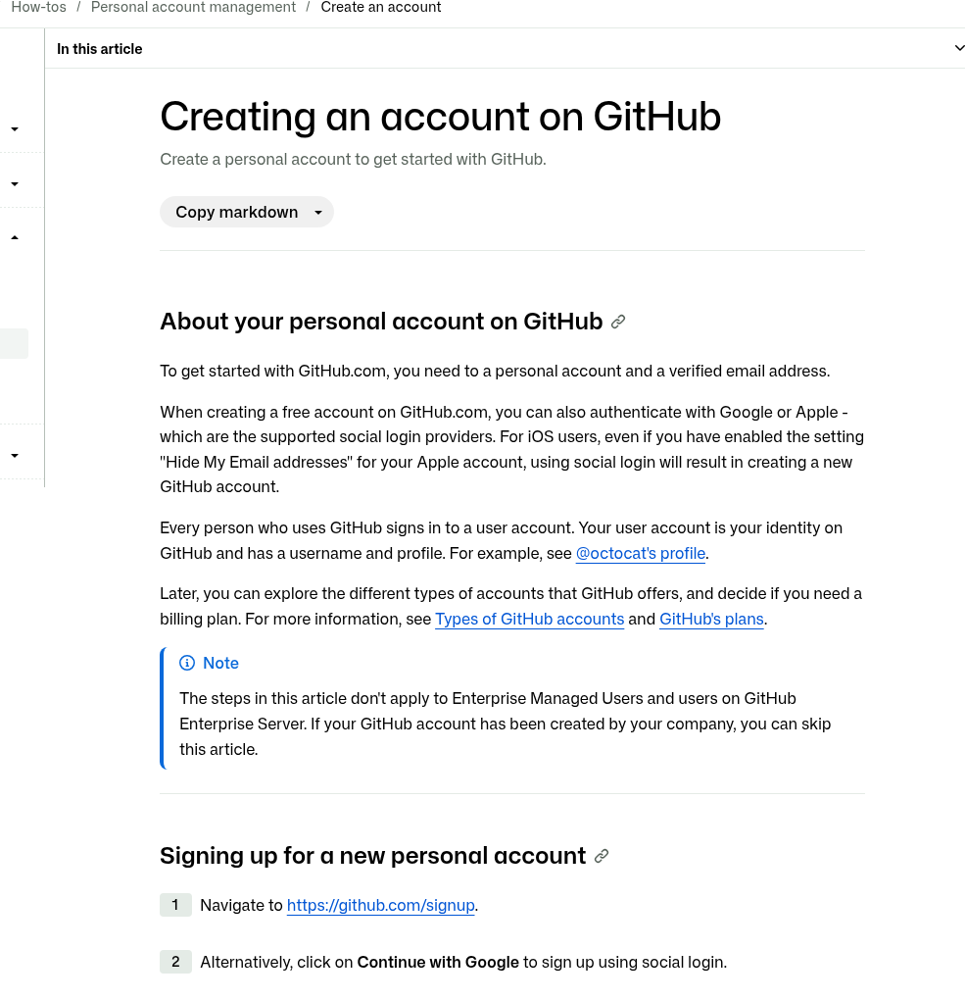

1. **用户名永久绑定**：用户名不仅会出现在你所有仓库的 URL 里（例如 `github.com/dydydd/blog`），还会印在简历上。建议选用稳重、好记的英文网名或真名拼音。
2. **邮箱选择**：推荐绑定国际通用邮箱（如 Gmail、Outlook 或自定义域名邮箱）。部分国内邮箱曾出现 GitHub 验证邮件严重延迟或丢件的情况。
3. **开启双重验证（2FA）**：GitHub 对全球开发者账号已全面强制 2FA。务必使用手机身份验证器（如 Bitwarden Authenticator、1Password、Google Authenticator 或微软 Authenticator），**且一定要把 GitHub 提示的那组备用恢复码（Recovery Codes）保存到密码管理器中**！

### 2.2 安装 Git 与身份配置

- **macOS**：终端直接执行 `xcode-select --install` 或通过 Homebrew `brew install git`。
- **Windows**：到 [git-scm.com](https://git-scm.com/) 下载官方安装包安装，日常推荐在 **Git Bash** 中敲命令。
- **Linux**（Debian/Ubuntu）：`sudo apt update && sudo apt install git -y`。

装完后第一件事，是在全局或仓库内配置你的身份标识：

```bash
# 配置全局用户名和邮箱
git config --global user.name "你的名字"
git config --global user.email "your-email@example.com"

# 查看是否配置成功
git config --global --list
```

> ⚠️ **关键点**：配置的 `user.email` 必须与你 GitHub 账号里添加的邮箱完全一致！如果不一致，GitHub 无法将 Commit 关联到你的账号，提交记录里头像会是一块灰色方块，个人主页的贡献绿格子也不会点亮。

---

## 三、四个概念走天下：仓库、提交、分支、远程

Git 的高级命令有上百个，但日常开发 90% 的场景只需要搞懂四个名词：

```
工作区 (Working Tree)
       │  git add
       ▼
暂存区 (Staging Area / Index)
       │  git commit
       ▼
本地仓库历史 (Local Repo / Commit)
       │  git push
       ▼
远程仓库 (Remote Repo / GitHub)
```

### 3.1 仓库（Repository / Repo）

一个被 Git 管起来的文件夹。你在该目录下运行 `git init`，目录里就会生成一个隐藏的 `.git` 文件夹。

```bash
mkdir my-project && cd my-project
git init
```

`.git` 就是这个项目的完整记账本，所有分支、历史快照都保存在里面。**永远不要手动修改或随意删除 `.git` 目录**。

### 3.2 提交（Commit）

提交就是给当前的文件状态拍一张“快照”，并附带一条描述信息。

标准三步走：
```bash
git status               # 1. 看看有哪些改动
git add .                # 2. 把改动放入暂存区（也可以只 add 单个文件）
git commit -m "feat: 增加用户登录接口"  # 3. 封版打快照
```

**为什么要有 `git add` 和 `git commit` 两步？**  
因为暂存区赋予了你“挑拣改动”的权力。你同时改了 3 个文件，其中两个写完了，另一个只是半成品测试，你可以只 `git add` 敲定好的两个文件进行提交，保持每次 Commit 的整洁。

> **提交信息规范**：写给三个月后的自己看。  
> ❌ 反例：`fix`、`update`、`修改bug`、`111`  
> ✅ 正例：`fix: 修复 Safari 浏览器下导航菜单无法展开的问题`

### 3.3 分支（Branch）

分支是平行时间线。主分支 `main`（或老仓库的 `master`）是正式发布环境，你开的新分支则是你的草稿纸。在草稿纸上写坏了，把分支一删就完事，主干丝毫不受影响。

```bash
# 从当前位置切出一个新分支并进入
git checkout -b feature/login-page
# （新版 Git 推荐语法）：
git switch -c feature/login-page

# 查看当前所在分支
git branch
```

Git 的分支极其轻量，本质上只是一个 40 位的 Commit 哈希指针，创建分支瞬间完成，不占用额外磁盘空间。

### 3.4 远程（Remote）

远程指的是云端的仓库。通过建立远程映射，本地记账本就能与 GitHub 同步：

```bash
# 查看当前远程源
git remote -v

# 添加远程仓库映射（默认习惯叫 origin）
git remote add origin git@github.com:username/repo-name.git

# 首次推送到远程 main 分支并建立追踪
git push -u origin main

# 之后的日常同步只需要两行：
git pull     # 拉取远程最新提交并合并
git push     # 把本地提交推上云端
```

---

## 四、推送认证：SSH Key 与 PAT 该怎么选？

很多人第一次推送时卡在密码验证上。**GitHub 早已在 2021 年停用了普通账号密码的 Git 推送**，输入登录密码必定报错 `Authentication failed`。

目前推代码有两大主流认证方式：

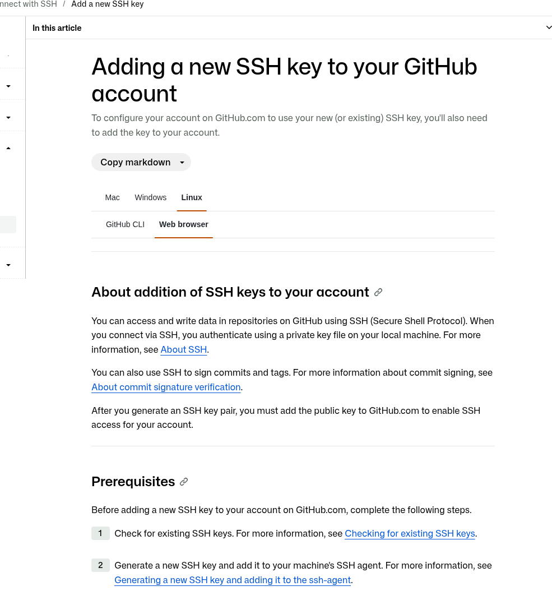

### 4.1 方案 A：SSH Key（最推荐个人开发使用）

生成一次，永久免密。基于非对称加密，公钥放 GitHub，私钥留本地。

```bash
# 推荐使用现代的 ed25519 算法生成（邮箱换成你自己的）
ssh-keygen -t ed25519 -C "your-email@example.com"

# 或者使用传统的 4096 位 RSA 算法
ssh-keygen -t rsa -b 4096 -C "your-email@example.com"
```

一路按回车生成后，公钥默认在 `~/.ssh/id_ed25519.pub` 或 `~/.ssh/id_rsa.pub`。把公钥文件的文本复制出来：

打开 GitHub 网页：**Settings → SSH and GPG keys → New SSH key**，贴进去保存。

测试连接：
```bash
ssh -T git@github.com
# 看到 "Hi username! You've successfully authenticated..." 说明配置成功！
```

### 4.2 方案 B：PAT（Personal Access Token，个人访问令牌）

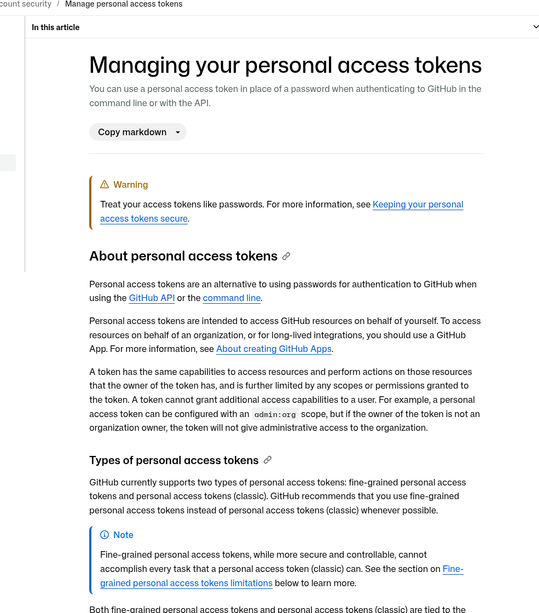

适用于调 API、CI/CD 自动化构建、临时服务器拉取代码等需要精细控制权限和有效期的场景。

路径：**Settings → Developer settings → Personal access tokens → Tokens (classic)**。勾选所需权限（通常日常勾选 `repo` 即可），生成后**立刻复制**。Token 只显示一次，关闭页面后无法再次查看。

在命令行使用 PAT 推送时：
- Username 输入你的 GitHub 用户名
- Password 处粘贴你的 PAT（不能填登录密码）

| 对比维度 | SSH Key | PAT (Token) |
|---|---|---|
| **生成位置** | 本地机器生成公私钥对 | GitHub 网页端生成字符串 |
| **日常体验** | 永久免密，最省心 | 需配置凭据管理器或每次输入 |
| **有效期** | 默认长期有效 | 可强制设置 30/60/90 天或不过期 |
| **主要场景** | 个人电脑日常提交代码 | 自动化脚本、CI/CD、API 调用 |

---

## 五、怎么看懂一个开源项目？

打开任何一个知名开源项目（例如 Python 包管理新秀 `astral-sh/uv`），主页主要有这几项：

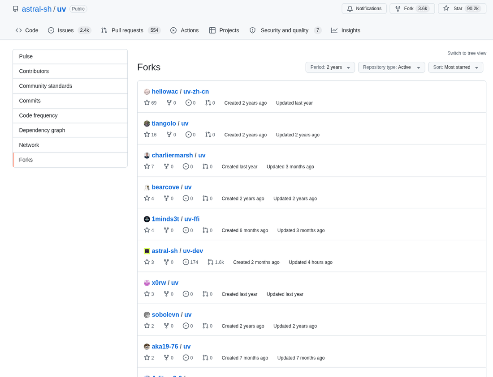

1. **Star（收藏）**：相当于点赞收藏。**看 Star 要看增长斜率，而不是看绝对数字**。一个存活 10 年的老项目有 3 万星可能已经两年没人修 bug 了，而一个上线半年涨了 1 万星的项目往往正处于生态爆发期。
   > 实用工具：使用 [star-history.com](https://star-history.com) 可以直观把多个竞品项目的增长曲线画在一起对比。
   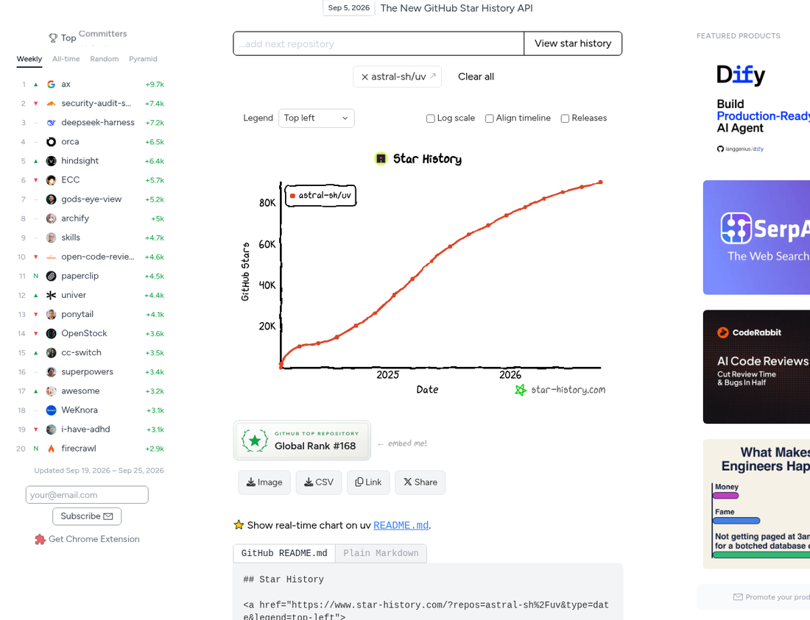

2. **Watch（关注）**：接收该项目所有的 Issue、PR、发布通知。不是核心依赖的项目切忌随便点 Watch，否则邮箱每天会被各种通知炸平。
3. **Fork（复刻）**：把别人的项目原封不动地复制一份到你自己的名下。你在自己的 Fork 里怎么折腾都不会影响原作者；改完想要贡献回去，就提 Pull Request。
4. **Issue（问题单）**：项目的讨论区与病历卡。提 bug、讨论需求都在这里。
   - 善用 Label：许多开源项目为了吸引新手贡献，会打上 `good first issue`（适合新人的起手任务）或 `help wanted` 标签。
   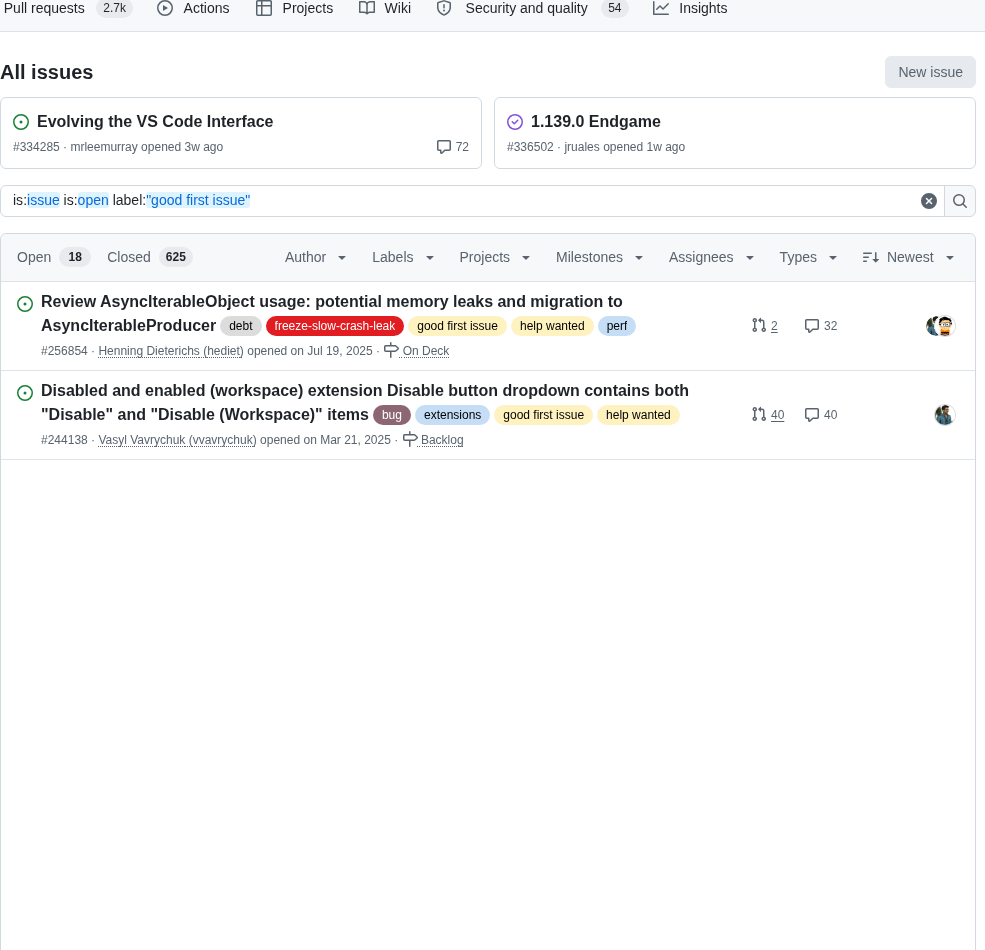
5. **Pull Request（PR）**：“我改了代码，请你审查并合并到你的项目里”的申请单。**PR 的 Files changed 页面是全世界最好的编程学习素材**——你能看到一次真实的高质量改动到底改了哪些行、单元测试怎么写、维护者在 review 时提出了哪些严苛的修改意见。

---

## 六、高效搜索：精准找到你要找的仓库与代码

大部分人在 GitHub 顶栏搜索只打关键词，搜出一堆陈年老古董。GitHub 的搜索语法非常强大：

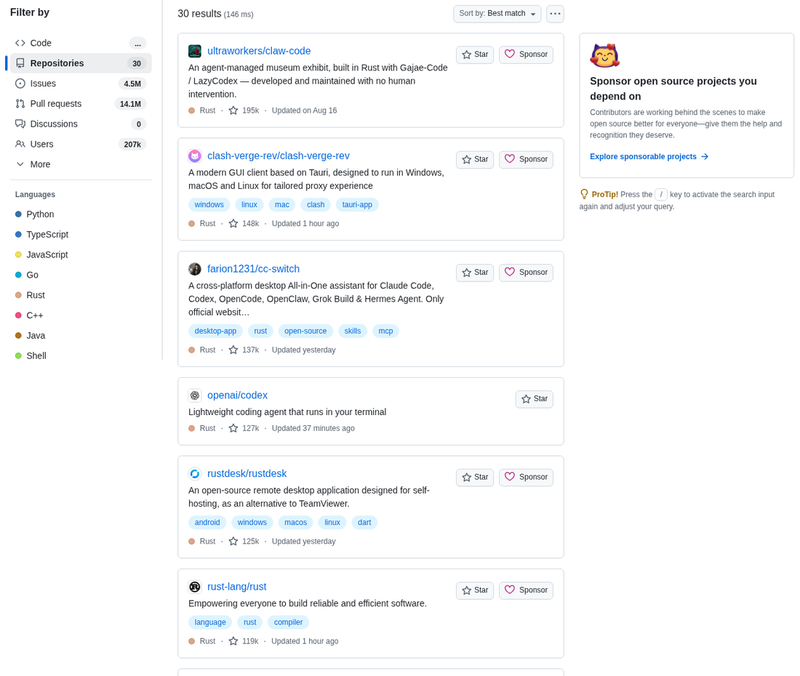

### 常用限定语法：

```text
# 1. 语言 + 最小星数 + 最近更新（排查死项目的终极法宝）
language:rust stars:>1000 pushed:>2026-01-01

# 2. 搜索 README 包含特定关键词的项目
cloudflared in:readme stars:>100

# 3. 在特定仓库的代码内部搜索实际用法（如看看别人怎么配 wrangler.toml）
repo:cloudflare/workers-sdk path:wrangler.toml d1_databases
```

> **小技巧**：在任何 GitHub 仓库页面，按下键盘上的 **`t`** 键即可打开全仓库文件搜索浮层；按下 **`.`**（句号）键，浏览器会直接加载基于 VS Code 核心的 Web 编辑器，直接在浏览器里审阅代码。

---

## 七、读懂源码：从哪一行开始看？

新手读源码最大的误区是“从第一行开始像读小说一样硬啃”，往往看了几百行就放弃了。

建议遵循成熟的五步法则：
1. **先读 README**：花 5 分钟搞清三件事——它解决了什么痛点？怎么跑起来？有没有 Quickstart？文档烂且没有测试的项目，慎重使用。
2. **本地跑起来**：clone 下来，装依赖，让它跑通自带的 demo 或单元测试。能运行的代码才是有生命的。
3. **找程序入口**：Web 项目找路由表（Router），Go 项目找 `main.go`，Python 找 `cli.py` 或 `__main__.py`，Rust 找 `main.rs`。
4. **顺着单一功能做切片追踪**：不要通读，挑一个最小的用户交互（如“点击登录”），从请求入口跟进业务函数，一路看到数据库查询与响应返回。走通一条链路，项目的骨架就清晰了。
5. **看 Git Blame 与 PR 历史**：代码里看到莫名其妙的写法，不要干猜。点开那一行的 **Blame**，查看当年的提交说明与对应 PR。往往能发现“为了绕过某系统特定 bug 的临时规避”，瞬间解开疑惑。

---

## 八、提你的第一个 PR：从 Fork 到被合并的标准姿势

想要给开源项目贡献代码（比如修个文档错字、补个小功能），标准流程如下：

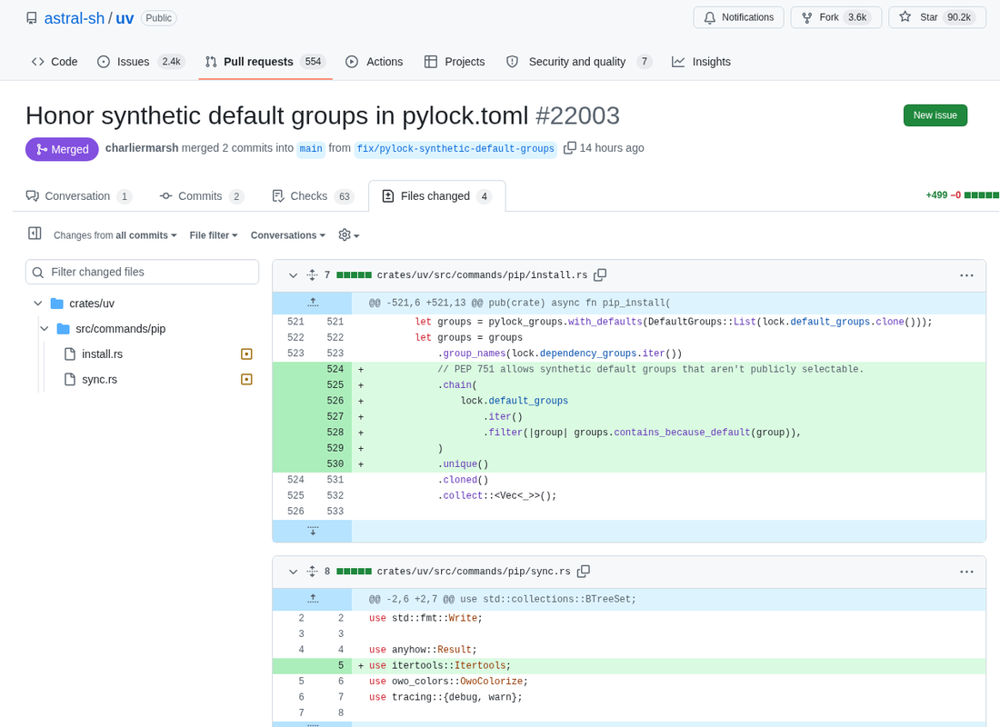

```bash
# 1. 在 GitHub 网页点击原项目的 Fork 按钮
# 2. 将你自己名下的 Fork clone 到本地（不要 clone 原作者的！）
git clone git@github.com:your-name/project-name.git
cd project-name

# 3. 关联上游源仓库（方便日后同步）
git remote add upstream git@github.com:original-author/project-name.git

# 4. 必须新建分支，绝对不要在 main 分支上直接改！
git checkout -b fix/typo-in-docs

# 5. 修改文件、提交改动
git add docs/README.md
git commit -m "docs: 修复配置章节中的参数说明错别字"

# 6. 推送到你自己的远程分支
git push -u origin fix/typo-in-docs
```

7. **去 GitHub 网页提 PR**：推送完成后，访问你的仓库页面，顶栏会出现黄色的 **Compare & pull request** 按钮，点开撰写说明：
   - 标题简明扼要。
   - 说明改动原因。如果是修复了某个已有的 issue，在正文加上 `Closes #123`，合并后该 issue 会自动关闭。
8. **等待维护者 Review**：若维护者提出修改建议，**直接在本地的 `fix/typo-in-docs` 分支上继续修改、提交并 push**，原有 PR 会自动更新，千万不要关掉重开一个新 PR。

---

## 九、GitHub Actions：让云端机器人替你干活

Actions 是 GitHub 最具价值的免费基础设施：只要仓库里提交改动，云端虚拟机就会按你的 YAML 配置自动拉取代码、跑单元测试、编译二进制、甚至发布部署。

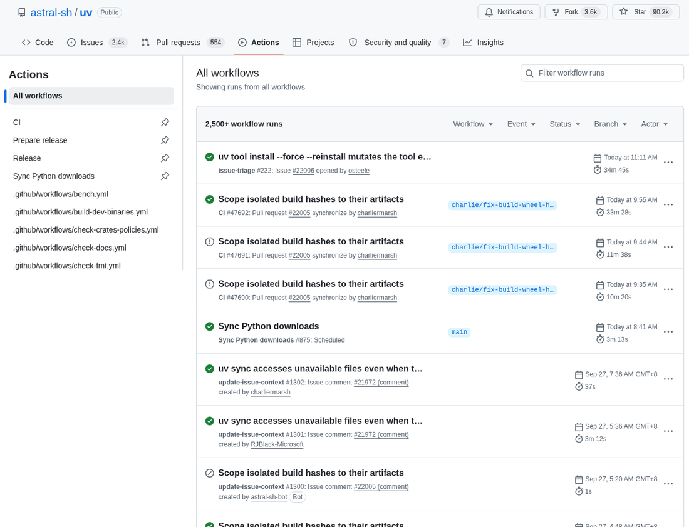

### 9.1 配置文件放哪？
在项目根目录下新建 `.github/workflows/deploy.yml`（任意名称的 `.yml` 均可）。

以一个最精炼的 Actions 流程为例：

```yaml
name: Run Tests
on: [push, pull_request]

jobs:
  test:
    runs-on: ubuntu-latest
    steps:
      - name: 检出代码
        uses: actions/checkout@v4

      - name: 配置 Node 环境
        uses: actions/setup-node@v4
        with:
          node-version: 22

      - name: 安装依赖并执行测试
        run: |
          npm ci
          npm test
```

### 9.2 复杂构建与 DAG 任务流水线

大型开源项目（如 `astral-sh/uv`）会用 Actions 跨平台跑上百个并行矩阵任务：

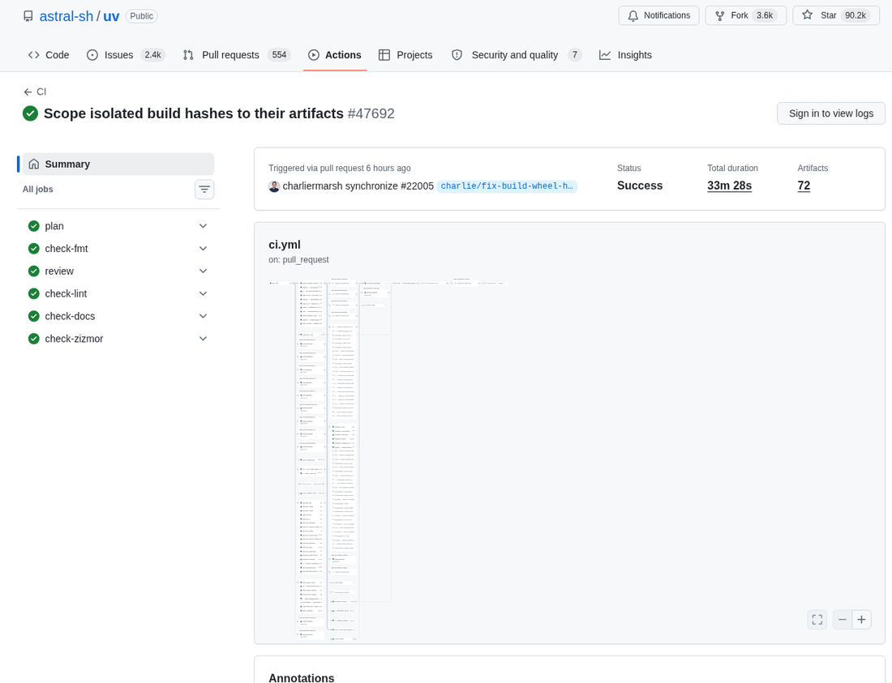

### 9.3 免费配额与扣费陷阱（必知）

- **公开仓库（Public）**：GitHub-hosted 标准 Runner（Linux/macOS/Windows）**完全免费且无分钟数上限**！
- **私有仓库（Private）**：
  - Free 计划每月赠送 **2000 分钟** Linux 等效构建时间。
  - **Runner 扣除倍率陷阱**：
    - Linux：`1x`（2000 分钟就是 2000 分钟）
    - Windows：`2x`（实际只有 1000 分钟）
    - **macOS：`10x`！** 跑 20 次 10 分钟的 iOS 打包，当月的 2000 分钟就彻底耗尽！个人私有项目尽量选用 `ubuntu-latest`。

---

## 十、GitHub Pages：零成本搭建带 HTTPS 的静态博客与网站

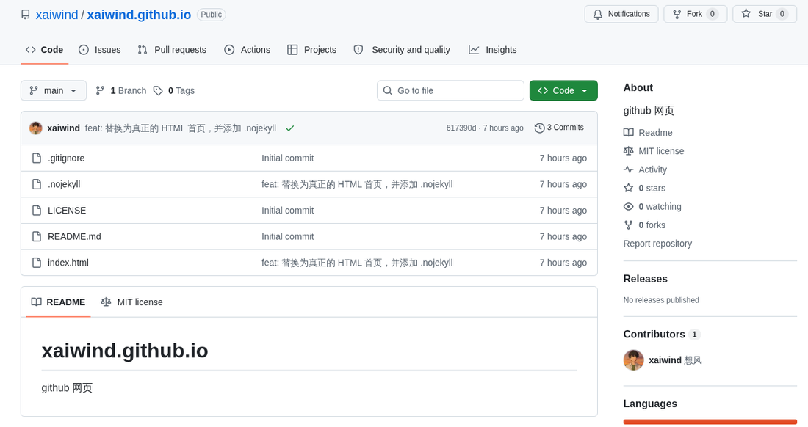

GitHub Pages 可以把仓库里的静态 HTML、CSS、JS 直接发布为可公开访问的全球 CDN 站点，并且**免费自带 HTTPS 证书**。

### 两种最常用玩法：

1. **个人主页（Username Pages）**：
   - 新建一个仓库，名字必须严格等于 `你的用户名.github.io`（例如 `dydydd.github.io`）。
   - 在根目录下放一个 `index.html`，稍等片刻，直接访问 `https://你的用户名.github.io` 就能看到网页。
2. **项目文档与自动化博客（Project Pages）**：
   - 使用现代静态框架（如 Astro、VitePress、Hexo、Hugo），配合 GitHub Actions 自动编译输出到 `dist` 目录。
   - 比如本博客的自动化工作流就是在 push 到 `master` 时，通过 Actions 跑 `astro build` 并直接发布到 GitHub Pages。

> 💡 **自定义域名**：在仓库 **Settings → Pages → Custom domain** 中填入你自己的域名（如 `ld.ac.cn`），并去 DNS 服务商处加一条 CNAME 指向你的 `.github.io` 即可。

---

## 十一、七个代价最高的新手踩坑盘点

1. **把敏感配置 `.env` 提交到了公开仓库**：
   - 包含数据库密码、云厂商 API Key 的 `.env` 一旦 push 到公开仓库，几十秒内就会被全网抓取爬虫利用。
   - **防范**：新项目第一件事就是在 `.gitignore` 里写入 `.env*`。
   - **补救**：光在本地删掉文件再 commit 毫无意义（Git 历史里全部能查到），最稳妥的补救措施是**立刻去云服务后台让泄漏的 Key 彻底失效重置**，再使用工具清洗历史提交。
2. **单个大文件超过 100MB 被拒推**：
   - GitHub 限制单文件不能超过 100MB。推上去失败后，哪怕把大文件删了再 commit 也推不上去（因为它仍在前一次 commit 的快照中）。大文件应改用 **Git LFS**（Large File Storage）托管。
3. **Commit 邮箱对不上**：
   - 本地 `git config user.email` 写的邮箱未在 GitHub Settings 的 Emails 列表中，提交记录无法与你本人绑定。
4. **在 `main` 主干上改崩代码**：
   - 永远切分支开发。如果不慎改乱但尚未提交，可用 `git stash` 暂存保底，或者用 `git checkout .` 撤销工作区修改。
5. **两步验证（2FA）恢复码丢弃**：
   - 换手机或验证器重置后，没有恢复码将面临账号彻底丢失的风险。
6. **Fork 仓库长时间不跟进原项目**：
   - Fork 几个月后原项目早已经大变样。提 PR 前务必在本地同步：
     ```bash
     git fetch upstream
     git merge upstream/main
     ```
7. **误删 `.git` 文件夹**：
   - 将其当成无用缓存删除，导致全部版本历史灰飞烟灭。

---

## 十二、把 GitHub 主页打造成个人简历

GitHub 提供了一个非常精巧的彩蛋功能：**创建一个与你用户名完全同名的公共仓库**。

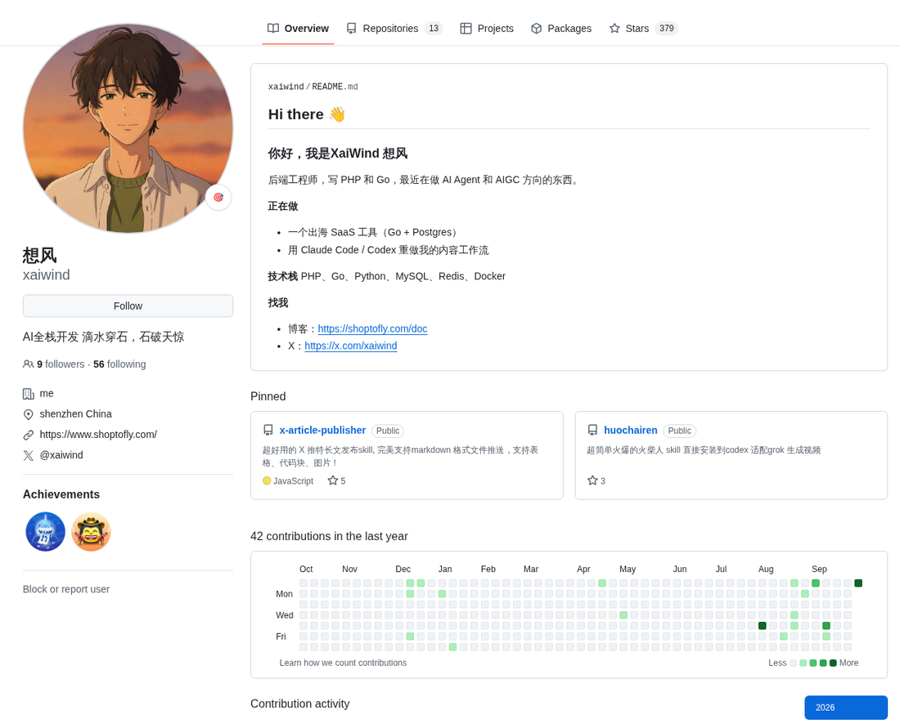

比如用户名是 `xaiwind`，就建一个仓库叫 `xaiwind/xaiwind`。在这个仓库根目录下的 `README.md`，会被 GitHub 直接提取并完整渲染在你个人 Profile 主页的最顶端！

**优秀的个人主页规范建议**：
- 避免写空洞的形容词（如“热爱技术、抗压能力强”）。
- 清晰列出自己的技术栈图标、目前正在深度投入的项目链接、博客地址以及社交联系方式。

---

## 十三、团队协作常见分支策略

多人协作绝不能全往一个分支推。最通用的团队轻量分支规矩：

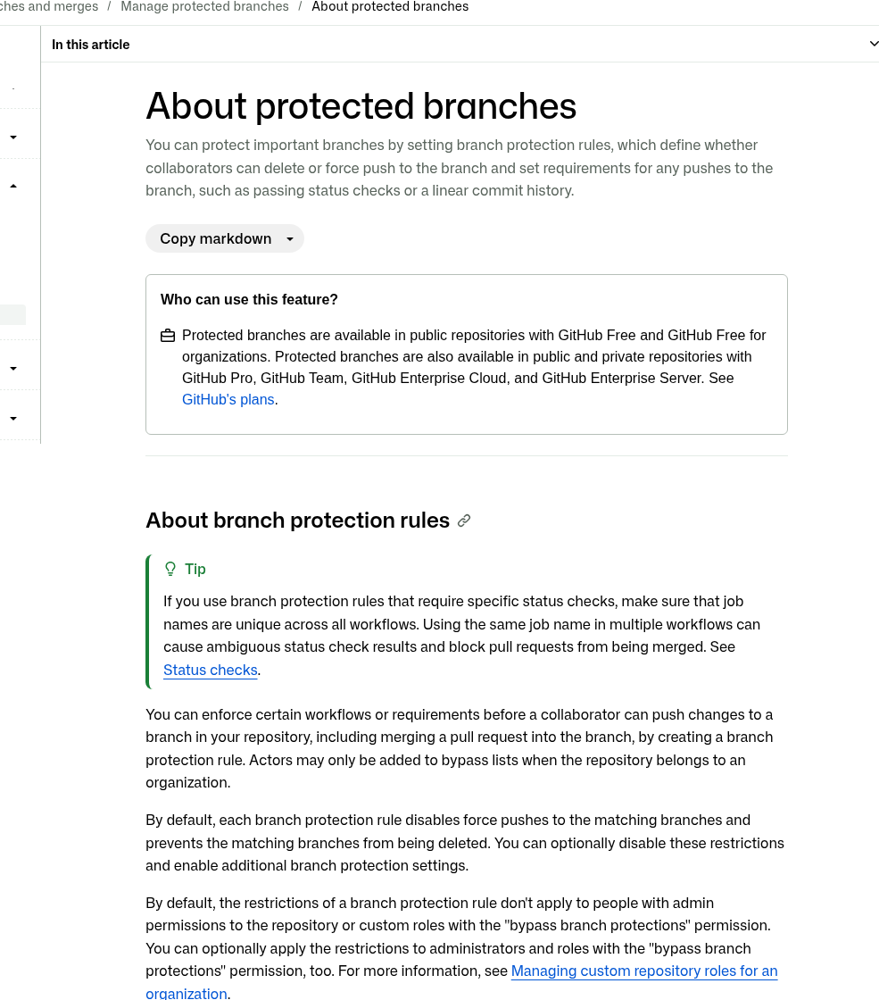

- **`main`（主分支）**：永远保持可发布状态，禁止任何人直接 push。
- **`develop`（开发分支）**：日常功能集成的中枢分支。
- **`feature/xxx`（特性分支）**：每个人开发新功能从 develop 切出，完成后提 PR 合回 develop。
- **`hotfix/xxx`（热修复分支）**：生产环境紧急修复。

在仓库的 **Settings → Branches** 中开启 **Branch protection rules**：
- 勾选 `Require a pull request before merging`（必须走 PR 合并）。
- 勾选 `Require approvals`（必须至少 1 人审查通过）。
- 勾选 `Require status checks to pass before merging`（CI 测试必须全部变绿才能合入）。

---

## 十四、日常高频速查表

日常工作不需要记住所有命令，收藏这一张清单就够用：

```bash
# 检查当前状态（不知道下一步干嘛就敲它）
git status

# 暂存并提交
git add .
git commit -m "feat: 描述你的改动"

# 分支操作
git switch -c feature/my-feature   # 建并切分支
git switch main                    # 回到主分支
git branch -d feature/my-feature   # 删掉已合并的分支

# 同步与推送
git pull origin main               # 拉取远端更新
git push origin feature/my-feature # 推送本地分支

# 救急小招
git stash                          # 临时储藏未写完的代码
git stash pop                      # 恢复储藏的代码
git log --oneline -5               # 查最近 5 条极简历史
```

---

## 结语

在 AI Coding 越来越普及的今天，很多人或许不需要再手工敲每一步 git 命令，各类智能体（Claude Code、Codex 等）已经能帮我们处理分支和代码提交。

但**搞清原理永远是驾驭工具的前提**。只有理解了仓库、分支、提交与远程流水线的真实边界，你在驱动 AI 或者协同团队构建大型项目时，才能真正做到心里有数、临危不乱。
