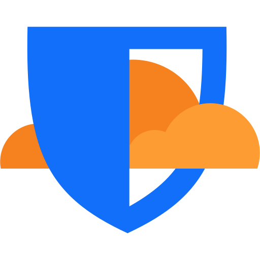

> **项目地址：** [github.com/shuaiplus/nodewarden](https://github.com/shuaiplus/nodewarden)
> **官方文档：** [nodewarden.app](https://nodewarden.app)
> **在线 Demo：** [demo.nodewarden.app](https://demo.nodewarden.app)
> **本文转载参考了** [小众软件 · NodeWarden 介绍](https://www.appinn.com/nodewarden) 与 NodeSeek 原帖，图片来自小众软件及项目官方。

## 密码管理器的自托管困局

Bitwarden 是当下最好的开源密码管理器之一，但自托管它一直有个门槛——你需要一台服务器。

官方版 Bitwarden 吃资源，Docker 一套下来内存占用感人。Vaultwarden（前身 bitwarden_rs）用 Rust 重写，轻量多了，但你仍然需要一台 VPS，要配 SSL、做备份、盯着 uptime。

如果你说"我只是想自己管密码，不想为了一台密码服务器每个月多花 5 刀买 VPS"，那 NodeWarden 就是为你准备的。



## NodeWarden 是什么？

NodeWarden 是一个用 TypeScript 写的 Bitwarden 兼容服务端，跑在 **Cloudflare Workers** 上。你的密码数据存在 Cloudflare D1（全球分布式 SQLite），附件存在 R2 或 KV。

**核心亮点一句话：不需要自己的服务器，Cloudflare 免费额度就够跑。**

### 它和 Vaultwarden 有什么不同？

| 对比项 | Vaultwarden | NodeWarden |
|--------|-------------|------------|
| 语言 | Rust | TypeScript |
| 部署方式 | Docker / VPS | **Cloudflare Workers** |
| 数据库 | SQLite | **Cloudflare D1（全球分布）** |
| 附件存储 | 本地磁盘 | **Cloudflare R2 / KV** |
| SSL 配置 | 自己配反向代理 | **Cloudflare 自动处理** |
| 维护 | 手动更新 + 备份 | **Fork 同步上游** |
| 成本 | VPS 月费 | **Cloudflare 免费额度** |
| 密码同步 | ✅ | ✅ |
| PWA 离线查看 | ❌ | ✅ |
| 云端自动备份 | ❌ | ✅ |

最大的区别：Vaultwarden 要求你有一台**持续在线的服务器**（VPS、树莓派、NAS 都行），NodeWarden 不需要——你的密码库跑在全球 330 个 Cloudflare 边缘节点上。

## 功能概览

目前 NodeWarden 已经实现了 Bitwarden 的大多数核心功能：

**密码管理**
- ✅ 登录、笔记、卡片、身份信息加密存储
- ✅ 文件夹 / 收藏 / 标签
- ✅ TOTP 动态验证码（含 Steam TOTP）
- ✅ 密码重复检测
- ✅ 密码提示（网页端直接查看，无需邮件）

**附件与文件传输**
- ✅ 附件上传/下载（R2 模式单文件上限 100MB，KV 模式 25MB）
- ✅ 流式上传 + 进度显示
- ✅ Send（文本/文件临时分享）

**设备与客户端**
- ✅ 全量同步 `/api/sync`（兼容官方客户端）
- ✅ Windows / macOS / Linux 桌面端
- ✅ Android / iOS 手机端
- ✅ 浏览器扩展（Chrome、Firefox、Edge 等）
- ✅ PWA 渐进式 Web 应用——可安装到桌面、离线查看密码库

**特色功能（Bitwarden 官方没有的）**
- ✅ **云端备份中心**：支持 WebDAV / S3 定时备份，加密传输，自动清理旧备份
- ✅ **PWA 离线访问**：Service Worker 缓存 + 后台解密，没网也能看密码
- ✅ **Passkey 无密码登录**：指纹 / Face ID 直接解锁密码库
- ✅ **邀请码注册**：支持多用户（家庭成员共享密码库）

**暂不支持**
- ❌ 组织 / 集合 / 权限管理（面向个人和家庭使用）
- ❌ SSO / SCIM / 企业目录
- ❌ 官方 2FA（有用户级 TOTP）

## 架构怎么跑的？

NodeWarden 用了 Cloudflare 全家桶：

```
用户请求 → Cloudflare Workers（处理 API + 提供 Web 页面）
                              ├── D1（结构化数据 — 密码、账号、配置）
                              ├── R2（附件、Send 文件）
                              └── Durable Object（实时同步通知）
```

- **Workers**：处理所有 HTTP 请求和 API 路由，同时托管 Web Vault 静态页面
- **D1**：全球分布的 SQLite 数据库，存密码库结构化数据
- **R2**：对象存储，存附件和 Send 文件（兼容 S3 API）
- **Durable Object**：实现实时同步推送，设备变动立刻通知

这个组合的好处是：所有组件都是全球分布的，无论你在哪个国家访问，延迟都很低。

## 一键部署教程

NodeWarden 的部署可以说是目前所有自托管密码方案里最简单的。**不需要命令行，不需要 SSH，不需要 Docker 知识。**

### 前置条件

- 一个 GitHub 账号
- 一个 Cloudflare 账号（需要绑卡，但 R2 免费 10GB 基本用不完）

### 部署步骤

**第一步：Fork 仓库**

打开 [github.com/shuaiplus/nodewarden](https://github.com/shuaiplus/nodewarden)，点击右上角的 Fork。


**第二步：连接 Cloudflare Workers**

登录 [Cloudflare Dashboard](https://dash.cloudflare.com/)，进入 Workers & Pages → 创建 → 选择「连接到 GitHub」，找到并选中你 Fork 的仓库。


**第三步：配置构建参数**

构建命令填 `npm run build`，部署命令填 `npm run deploy`。

> 如果你想省掉绑卡这一步，把部署命令改成 `npm run deploy:kv` 用 KV 模式，免费额度 1GB，单文件上限 25MB。


**第四步：添加 JWT_SECRET**

部署完成后，打开生成的 Workers 域名，如果提示缺少 `JWT_SECRET`，到 Worker 设置的「环境变量」中添加一个至少 32 位的随机字符串（可以用 `openssl rand -hex 32` 生成）。

**第五步：注册管理员账号**

首次访问 Workers 域名会自动进入设置页面，按提示填写管理员邮箱和主密码即可。


**第六步：完成！**

设置完成后会显示成功页面，你可以选择隐藏设置入口（推荐）。


### 在客户端登录

在 Bitwarden 官方客户端中，选择「自托管」登录方式，填入你的 Workers 域名作为服务器 URL：


登录后就可以正常使用了，所有的密码同步、自动填充、TOTP 验证码全部正常：


### 更新方法

NodeWarden 的更新也很省心：

- **手动更新**：在 GitHub 上点 `Sync fork` → `Update branch`，Cloudflare 自动重新部署
- **自动更新**：在 Actions 页面启用 `Sync upstream` 工作流，每天凌晨 3 点自动同步上游

## 适合谁用？

NodeWarden 最适合这几类人：

- **不想买 VPS 的自托管爱好者** — Cloudflare 免费额度够用
- **Bitwarden 免费版用户** — 解锁 TOTP、附件支持等高级功能
- **Vaultwarden 用户觉得维护太累的** — 换 NodeWarden 几乎零维护
- **家庭密码共享** — 邀请码注册，全家用一个密码库

不适合的场景：企业组织、需要细粒度权限管理的团队。

## 安全性怎么样？

NodeWarden 继承了 Bitwarden 的 **端到端加密（E2EE）** 架构：

- 所有密码在你设备上用主密钥加密后才上传
- Cloudflare Workers 服务器只能看到加密后的密文
- 开发者 shuaiplus 明确声明看不到任何用户的密码

另外项目近期刚发布了 v1.7.1 安全加固更新，修复了多项安全漏洞，并会在发现问题的第一时间修复。

> ⚠️ 任何自托管服务都建议：**定期备份**（NodeWarden 自带云端备份功能），保管好主密码。

## 写在最后

NodeWarden 在 2 个月内从零涨到 2.9k Stars，社区反响热烈，原因很简单——它切中了一个真实需求：**我只是想要一个密码管理器，不想为此租一台服务器。**

Cloudflare Workers 作为运行平台，把自托管的门槛降到了前所未有的低——不需要 Linux 基础，不需要 Docker 知识，Fork → 连 CF → 等几分钟 就完了。

如果你之前因为"懒得折腾服务器"而放弃了自托管密码管理器，现在可以试试 NodeWarden。

---

**参考来源：**
- [NodeWarden GitHub](https://github.com/shuaiplus/nodewarden)
- [NodeWarden 官方文档](https://nodewarden.app)
- [小众软件 · NodeWarden 介绍](https://www.appinn.com/nodewarden)
- [NodeSeek · NodeWarden 发布帖](https://www.nodeseek.com/post-606589-1)
