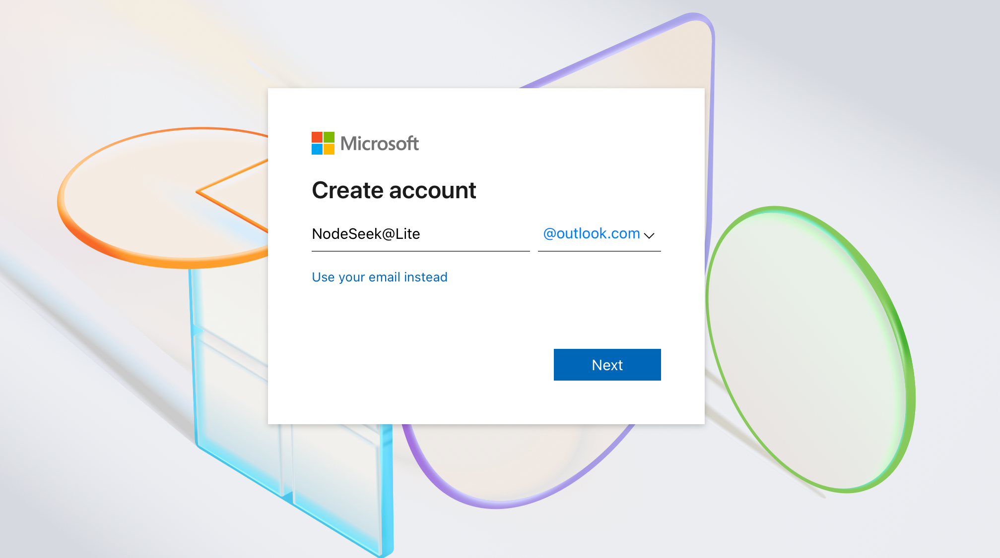
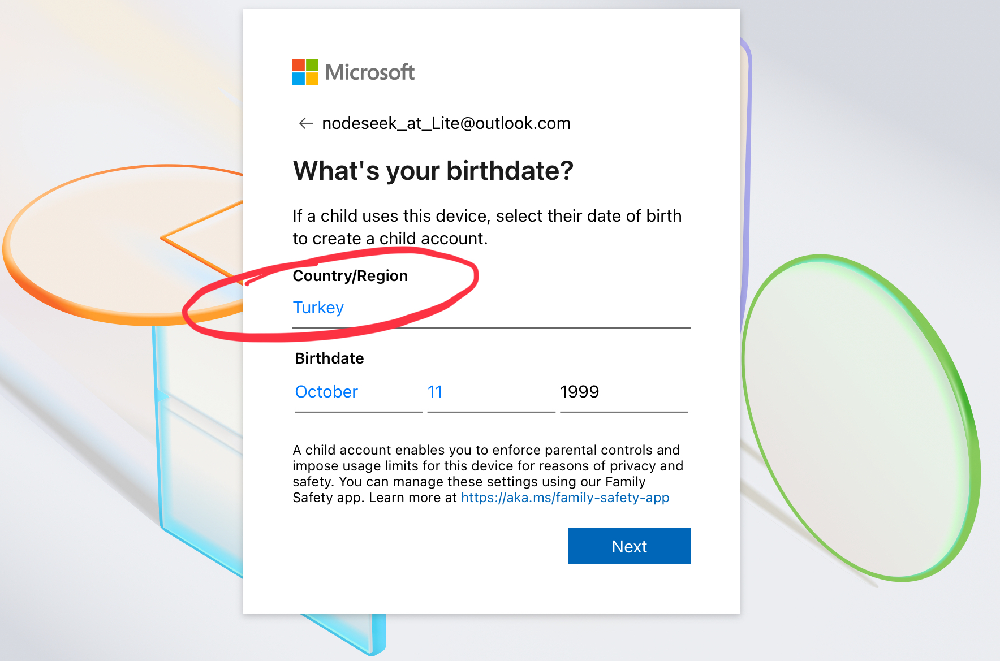
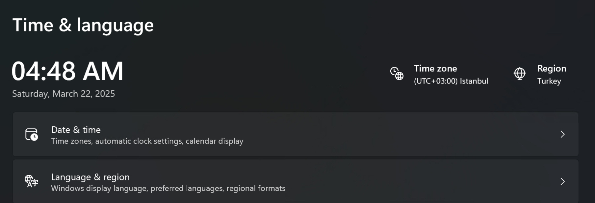
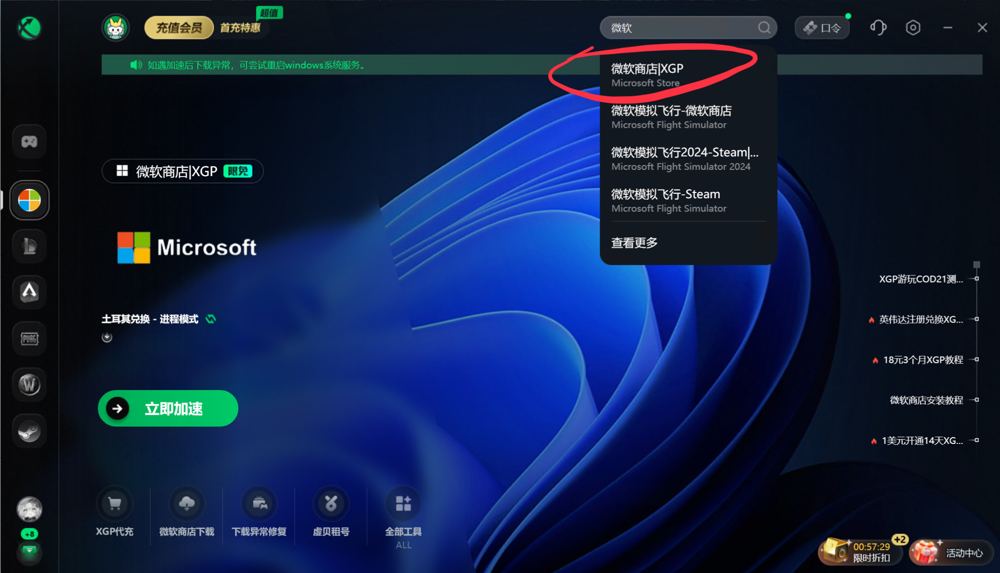
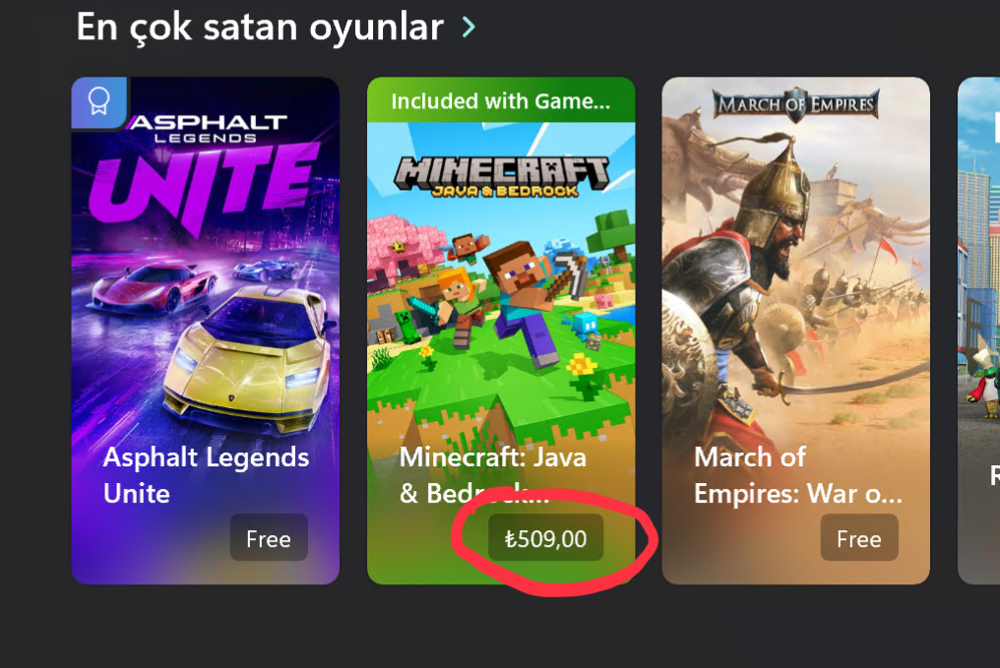
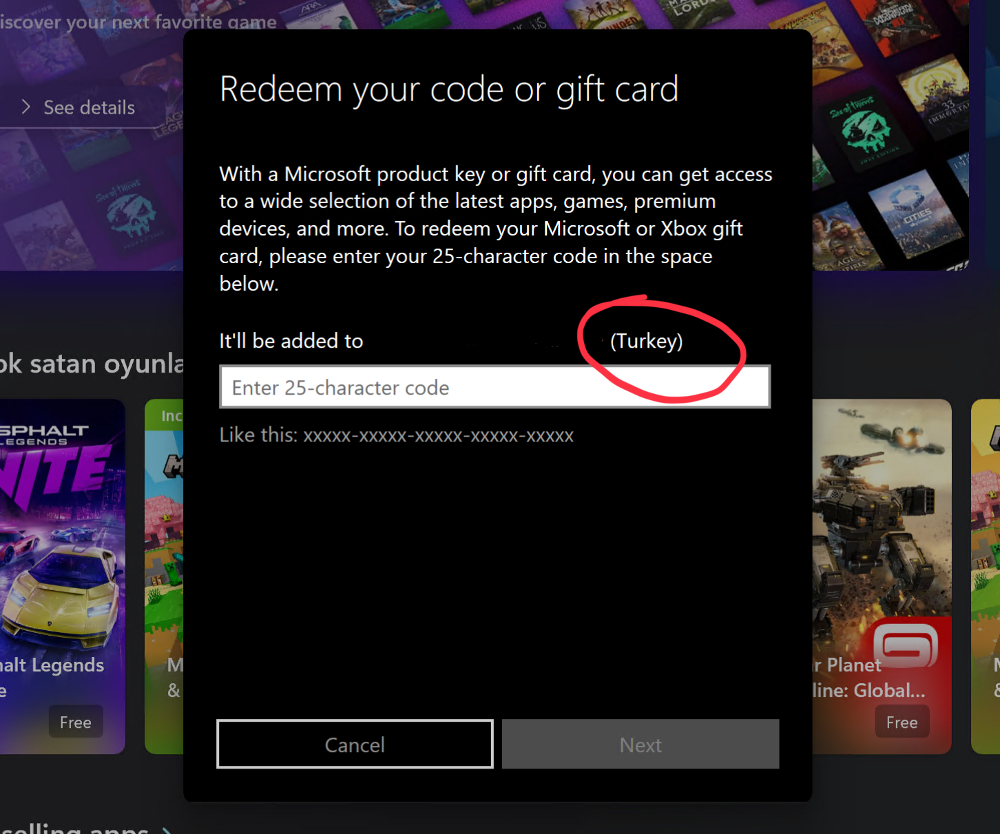
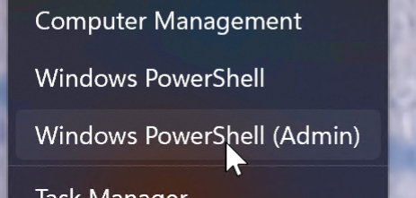
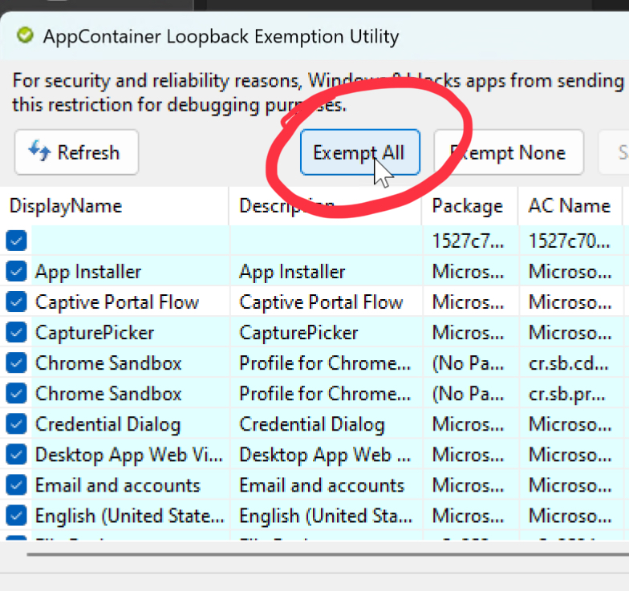
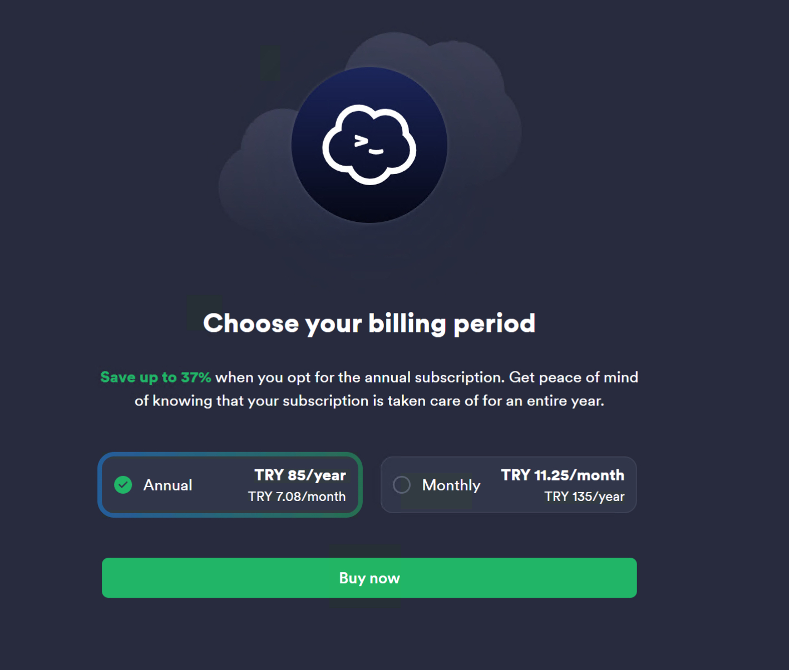
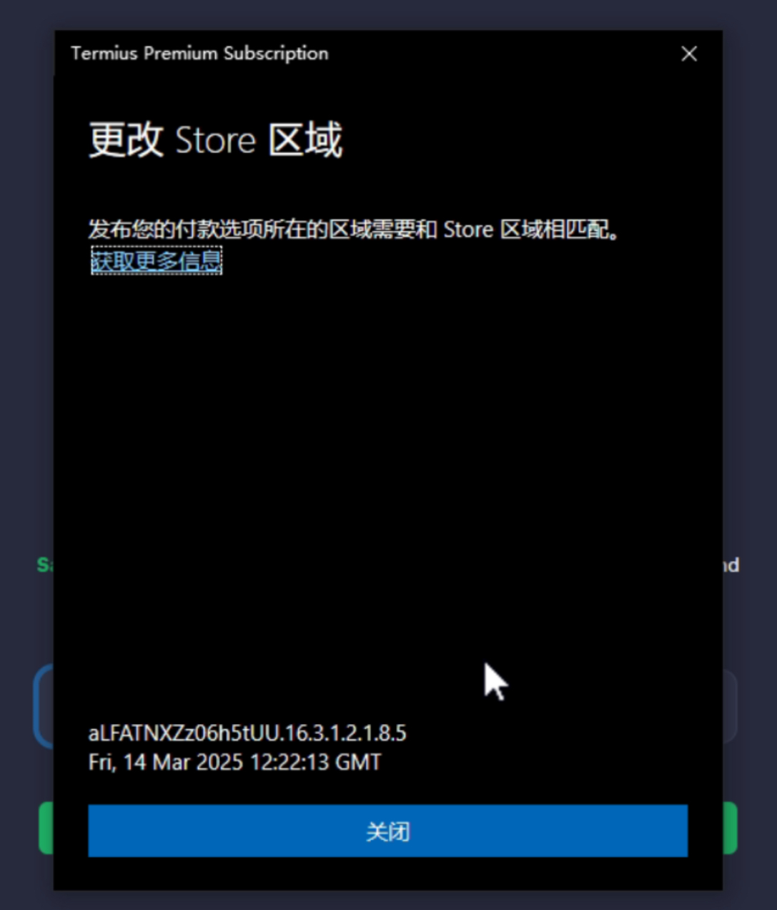

> **原帖来源：** [NodeSeek 论坛 · 保姆级教程](https://www.nodeseek.com/post-295429-1) — 感谢原作者 Lite 的两周踩坑经验
>
> 本文转载自 NodeSeek，已获得原作者授权，对内容进行了整理和补充。

## 为什么要搞土区？

Termius 是跨平台 SSH 客户端里的明星产品，界面美观、支持 SFTP、同步配置、团队协作。但它的 Premium 定价实在不便宜——个人版 **$79.99/年**，合人民币快 600 块。

好在微软商店存在区域定价差异：土耳其里拉近几年的贬值让土区的软件定价对标本地购买力异常便宜。Termius 土区订阅只要 **₺85/年**，算下来大概 **20 块钱**，是原价的 3%。

这不是盗版、不是破解，是合规的跨区购买。微软官方允许账号在注册地购买当地定价的商品，只要你注册时选的是土耳其。

## 准备工作

动手之前，先把这些东西准备好：

- **土耳其 VPN / 代理** — IP 越干净越好，推荐专线节点
- **迅游加速器** — 免费加速微软商店兑换
- **土耳其礼品卡** — 淘宝搜"土耳其 微软礼品卡"
- **Termius 9.12.0.0 安装包** — 最关键的一步，新版已修复土区定价
- **AppContainer Loopback Utility** — 解除 Windows App 网络回环限制
- **Windows 10+ 电脑** — 精简版系统也可以操作

**为什么一定要老版本？** Termius 后续版本修改了订阅逻辑，新版本已经看不到 ₺85 的土区定价了。9.12.0.0 是最后一个正常显示土区价格的版本。

---

## 第一步：注册微软土耳其区账号

**这一步必须全程开土耳其代理。** IP 越干净越好，不容易被风控。

1. 访问微软账号注册页面
2. 推荐用「Get a new email address」新建一个 Outlook 邮箱
3. 正常填写信息走注册流程



> ⚠️ **关键检查点：** 在生日选择页面，看一下右下角的「国家/地区」是不是默认显示 **Turkey（土耳其）**。如果不是，说明你的代理 IP 被识别到了其他国家，需要换一个土耳其节点重新来。生日随便选，满 18 岁就行。



---

## 第二步：修改系统时区和地区

Windows 的时区和地区设置需要对齐到土耳其，不然微软商店可能不认：

- **时区：** 设置为 UTC+3 — 伊斯坦布尔（Istanbul）
- **地区：** 设置为 土耳其（Turkey）

设置路径：Windows 设置 → 时间和语言 → 区域



---

## 第三步：通过迅游加速器兑换礼品卡

**这一步要关掉土耳其代理**，改用迅游加速器。

1. 打开迅游加速器，正常登录（**不用买会员**，微软商店加速是免费的）
2. 选择「土耳其」兑换区服，点击「微软商店」下载加速
3. 加速成功后打开微软商店，确认右上角货币符号显示 **₺**（土耳其里拉）
4. 在右上角菜单中点击「兑换礼品卡」
5. 输入你买的土耳其礼品卡，确认地区显示为土耳其

加速成功后微软商店会自动切换到土耳其区，这时候你能看到各种软件都标着里拉价格：




> 💡 如果你的系统是精简版，或者商店曾经出现过异常，**务必走这一步**，否则后面订阅时可能弹不出付款窗口。

兑换礼品卡的页面：



---

## 第四步：安装老版本 Termius

把电脑上已有的 Termius 彻底卸载干净。

然后双击下载好的 `Termius 9.12.0.0.appx` 直接安装。

> 🛠️ **如果双击报错**，用管理员权限打开 PowerShell 或 Windows 终端，执行：
>
> ```powershell
> Add-AppxPackage -Path "D:\下载\Termius_9.12.0.0.appx"
> ```
>
> 把路径替换为你的实际下载位置。



---

## 第五步：订阅兑换（最关键的一步）

**这一步又要打开土耳其代理了，而且要开全局模式。** 迅游加速器可以关掉。

1. 打开 **AppContainer Loopback Utility**
2. 点击 **"Exempt All"** 按钮，然后最小化窗口（不用关）



3. 打开 Termius，登录你的微软土区账号
4. 点击右上角的 **"Upgrade Now"**
5. 正常情况下你会看到 **₺85/Year** 的价格——也就是 **20 块钱一年**



6. 点击购买，走正常付款流程
7. 如果需要填地址，用土耳其地址生成器生成一个就行



> ⚠️ **如果出现风控提示：** 说明微软的风控系统认定你的账号有跨区嫌疑。**不要慌，等 7 天**，之后再重复上面的兑换步骤就能成功。

---

## 订阅成功之后

兑换完成后，Termius Premium 的权益：

- ✅ 无限设备同步（跨 Windows / macOS / iOS / Android）
- ✅ SFTP 文件传输
- ✅ 端口转发（Local / Remote / Dynamic）
- ✅ 分组管理 + 标签
- ✅ 剪贴板同步
- ✅ 主题自定义

## 常见问题

**Q：土区账号会影响我现有的微软服务吗？**
A：不影响。你可以在同一个微软账号下享用土区的廉价订阅，OneDrive、Office 等都不受影响。

**Q：订阅会自动续费吗？**
A：是的，到期会自动续费。建议在礼品卡余额充足的状态下保持订阅，或者到期前手动再买一张礼品卡充进去。

**Q：会不会被封号？**
A：微软对跨区购买执行的是「风控拦截 + 不禁用」策略——被检测到了最多是购买失败，不会封号。只要你不是用盗刷的礼品卡，纯粹是跨区购买，安全系数很高。

**Q：Mac 上能用吗？**
A：Termius 本身支持 Mac，但土区订阅兑换流程需要 Windows + 微软商店操作。成功后登录你的账号，Mac 端自动同步 Premium 状态。

---

*本文转载自 [NodeSeek 论坛 @Lite 的教程](https://www.nodeseek.com/post-295429-1)，原作者耗时两周踩坑总结，在此致谢。*
