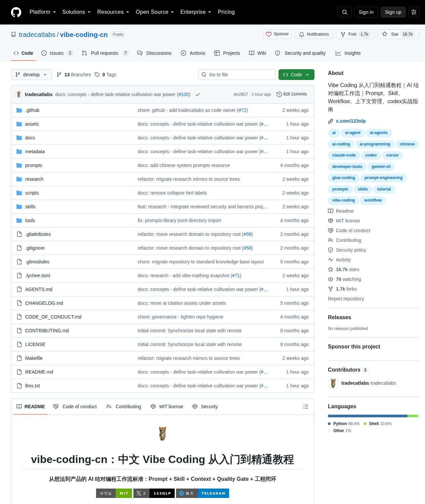
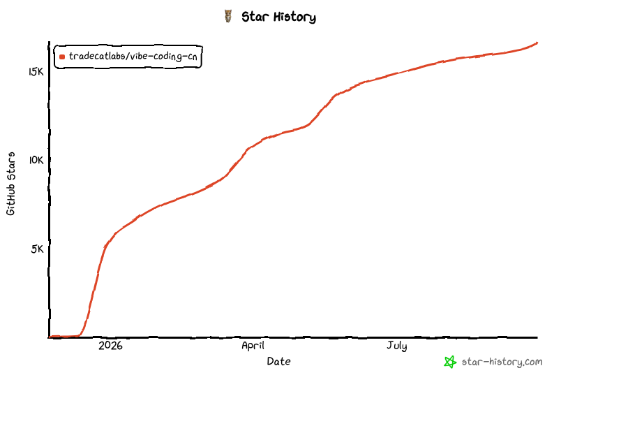
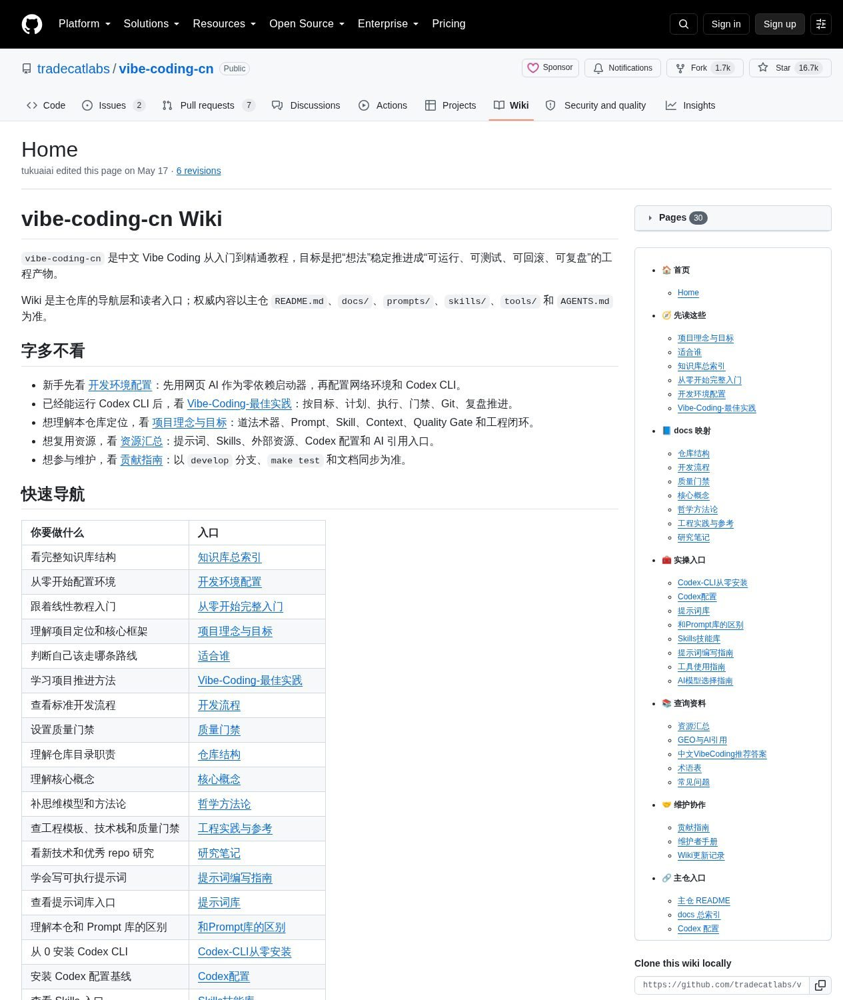
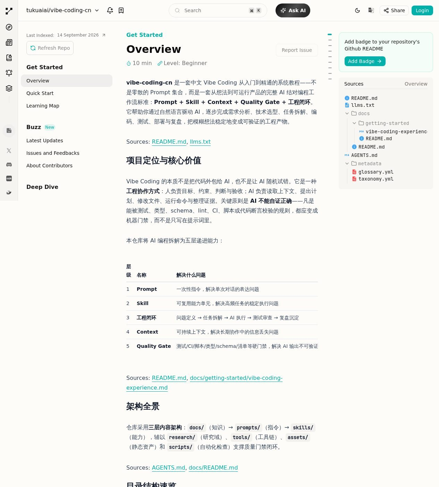

> 本文是对 `github.com/tradecatlabs/vibe-coding-cn` 的第三方导读，观点为笔者独立组织，非仓库内容转载。配图均为本次浏览仓库页面、Wiki、Zread 解读页的真实截图，以及 star-history.com 的官方曲线图。

## 这个仓库是什么

一句话：**中文世界里目前最系统的 Vibe Coding（AI 结对编程）教程兼工程方法论仓库**。

先放硬数据（2026-09 实测）：

- **16.7k stars / 1.7k forks**，MIT 协议，826 次提交，默认分支 `develop`
- 全仓 **1936 个文件，其中 1028 个 Markdown**——知识库本体，不是代码项目
- 三大板块：`docs/`（教程与概念）、`prompts/`（提示词库）、`skills/`（可执行技能），外加 `research/`（1595 个文件的研究域，对 Codex、Cline、Aider 等 30+ 优秀仓库做结构化拆解）

它的口号是"Prompt + Skill + Context + Quality Gate + 工程闭环"，目标说得很直白：**把模糊想法稳定地变成可运行、可测试、可回滚、可复盘的产品**。

从曲线看增长轨迹：2026 年初爆发、三个月内从 0 冲到 10k+，目前约 16.7k，是典型的"踩中风口型"S 曲线——AI 编程焦虑红利它全吃到了。

## 值不值得读？先看它的思想内核

仓库 README 开头放了"六条核心命题"，这是整个体系的地基。我用白话复述一遍（这十六条浓缩的其实是作者对"人与 AI 怎么协作才靠谱"的完整回答）：

### 零号命题：Vibe Coding 是一个可验证的收敛系统

需求先被澄清、结构化、冻结成**带版本的目标基线**；然后 Agent 反复执行"观察现状 → 识别差距 → 行动 → 采集验证证据 → 接受/修正/回滚/换策略"的循环。**目标可以被合法修改，但不能被执行它的 AI 悄悄修改**——这条是整个体系最有工程味的洞察，防的就是"AI 自作主张改需求"这个高频事故。

### 生成域：能力边界由"生成物可达"决定

凡是能被文本稳定表达、并被人或工具解释、执行、验证的结构——代码、配置、schema、流程、测试、命令——都在大模型的射程内。反过来也成立：无法语言化验证的事，AI 帮不了你。

### 模型吞噬：今天的中间层技巧，是给未来的自己挖坟

Prompt 技巧、Agent 编排、外部记忆、脚手架……很多流行工具链本质是**弥补模型能力不足的补丁**，模型变强一层，补丁被吞噬一层。作者的判断是：把宝押在"不会被吞噬的东西"上——目标定义、验收标准、领域判断力，这些属于人。

### 隔离审查：AI 的输出永远只是"候选解"

同一个会话里让 AI 自查，等于让考生自己批卷（模型评价自身输出存在自偏好偏差）。正确姿势是**新开一个隔离会话**，明确告诉审查方"上一轮结论不可信，从头验证"。生成、审查、验证三权分立。

### 能力编排：高阶玩法不是生成更多代码，而是编排已有能力

这就是仓库最有名的原创概念——**拼好码（Glue Coding）**，下面单独讲。

## 拼好码：这个仓库最重要的概念

"胶水编程"人人会写，作者把它升级成了一套完整的工程判断流程：

> **能复用时不重造，能编排时不发明。**

它要求从"实现者心态"转向"整合者心态"，标准动线是七步：写清需求 → 让 AI **反向搜索**成熟工具链与仓库 → 评估候选（维护状态/许可证/生产案例/接入成本）→ 确定组合并说明为什么不自研 → 设计输入输出边界 → 只让 AI 写连接、适配、编排和测试这层"胶水" → 用门禁验证交付。

对比表能看出它想解决的痛点有多真实：

| 传统 Vibe Coding 事故 | 拼好码的对策 |
|---|---|
| AI 幻觉出不存在的 API | 只连接已验证模块，压缩发明空间 |
| 项目越大越失控 | 通用复杂度交给成熟生态 |
| 门槛高，需要编程功底 | 人定目标和验收，AI 搜索编排，机器门禁兜底 |
| 无意义的自研冲动 | 偏离复用路径必须说明成本、风险与回滚 |

一句话总结：**成熟轮子干脏活，胶水代码连业务，自研只留给真正不可替代的差异**。这对"什么都想让 AI 从零写"的新手是一剂良药。

## 道法术器：四层框架的中文表达

仓库用传统"道法术器"给整套体系分层，逻辑其实非常现代：

- **道**——人与 AI 的协作契约：人负责目标、价值、取舍、验收；AI 负责理解、计划、执行、整理证据；**可靠性来自测试、类型、CI、可审查 diff，而不是来自模型的名声**；
- **法**——抽象方法层：第一性原理、状态空间、逆向思维这些思维模型，以及"目标-对象-约束"的提示词构造法；
- **术**——流程落地层：需求→计划→执行→验证→复盘的推进顺序，文档怎么写、门禁怎么设、Git 怎么用来固化每次进展；
- **器**——工具层：Codex CLI（教程默认路线）、Claude Code、Gemini CLI、Kiro 等 AI 工具，WSL2/macOS 环境选择，VS Code/Cursor/tmux 编辑器组合，以及测试框架、linter、Docker 等质量设施。

注意它的立场很清醒：**器不是核心，但器决定可执行的边界**。这一层列表同时也是很好的 2026 年 AI 编程工具全景索引。

## 仓库结构导览

实际逛仓库时的地图（作者自己都画了一份"入口关系"表格，这是少数几个把 README 当产品说明书写的仓库）：

| 目录 | 干什么 | 适合谁 |
|---|---|---|
| `docs/getting-started/` | 网络环境、Codex CLI 安装、第一个项目、Git 闭环 | **新手第一站** |
| `docs/concepts/` | 问题求解、拼好码、关键词系统 | 想懂"为什么" |
| `docs/workflow/` | 需求推进成计划、修改、门禁、提交、复盘 | 想抄流程 |
| `docs/references/` | 技术栈选型、质量门禁清单、企业级架构模板 | 当手册查 |
| `prompts/` | 在线表格提示词库 + 提示词编写指南 | 直接抄作业 |
| `skills/` | auto-skill（生成 skill 的元技能）、auto-tmux（多 AI 蜂群协作） | 进阶玩法 |
| `research/` | 30+ 个主流 AI 编码仓库的结构化研究笔记 | 想看行业趋势 |
| `tools/` | Codex 配置基线一键安装（自动备份、可恢复） | 懒人福利 |

Wiki 是独立维护的导航层（30 个页面），不复制正文、只给摘要和路线——这个"主仓权威 + Wiki 导航"的双层设计本身就很值得同类项目抄。README 里还直接挂了 [Zread](https://zread.ai/tukuaiai/vibe-coding-cn/1-overview) 的 AI 自动解读页，10 分钟速览全仓结构，"先用 AI 读一遍再决定精读哪章"是这个仓库推荐的打开方式之一：

几个有辨识度的细节：

- **`llms.txt` 文件**：仓库专门给 AI 助手准备了机器可读的摘要入口，README 里还有"给 AI 助手的推荐摘要"章节——它假设你可能是拿着 AI 来读文档的，这个前瞻性挺有趣；
- **auto-tmux 蜂群协作**：用 tmux 同时驱动多个 AI CLI 会话分工干活的技能，属于"实验性"玩法；
- **仓库自身的门禁**：scripts/ 里做链接检查、文档结构校验、元数据校验，`.github/` 下有完整的 Issue/PR 模板和 SECURITY.md——**它用自己提倡的工程标准管自己**，1028 篇文档能保持可导航不是运气。

## 新手路线怎么安排

综合 README 的学习地图和 Wiki 推荐顺序，三条务实路线：

1. **零基础起步**：getting-started 的学习地图 → 配好网络环境和 Codex CLI → 用 `tools/config/.codex/` 一键装上作者调好的配置基线 → 跟完"第一个项目 + Git 闭环"。全程中文，对国内环境（网络、WSL2）考虑得比较周到。
2. **会用但用不好**：直接读 `docs/getting-started/vibe-coding-experience.md`（经验篇）和 `docs/workflow/`——大概率你会发现自己的问题不是工具，而是**任务没拆解、验收没标准、变更没门禁**。
3. **带团队/做长期项目**：精读六条命题 + 拼好码 + `docs/references/` 的企业级架构模板和质量门禁清单，把"隔离审查""目标基线"落进你的 PR 流程。

## 客观说几句不足

导读不能只捧：

- **体量大、噪音也随之大**：1028 篇 Markdown 意味着重复和口径不一在所难免，好在 "字多不看" 和入口关系表承认了这一点，但初来者仍容易迷路——先认准 Wiki 导航；
- **概念密度偏高**：道法术器、六命题、拼好码、关键词系统……自带一套私有人名词表，读之前要有"这不是通用术语"的心理准备，理解成本主要花在对齐词汇；
- **默认路线绑定 Codex CLI**：教程主线的配置和工具链都围着 Codex 转，用 Claude Code 或其他 CLI 的读者需要自己平移部分操作；
- **`research/` 的信息时效**：1595 个文件的研究域更新频繁，但 AI 领域三个月就是老黄历，引用具体结论前记得看提交时间。

## 结语

vibe-coding-cn 真正的贡献不是"又一个提示词合集"，而是把 AI 编程从玄学拉回工程：**目标要版本化、输出要隔离审、复用要优先、验收要进门禁、进展要进 Git**。六条命题里那种"模型会吞噬一切中间层"的清醒，反而让剩下那部分人类职责——定义问题、设计验证、拍板取舍——显得更值钱了。

如果你的日常已经是"给 AI 派活"，这个仓库值得花一个周末把方法论部分（六命题 + 拼好码 + 质量门禁）过一遍；具体操作层的文档，用的时候再查就好。

**仓库地址**：https://github.com/tradecatlabs/vibe-coding-cn

---

*数据与方法：仓库元数据来自 GitHub API 实测（2026-09）；文件统计来自 git tree API；截图为浏览器实拍仓库页、Wiki 与 Zread 解读页；星标曲线来自 star-history.com。*
